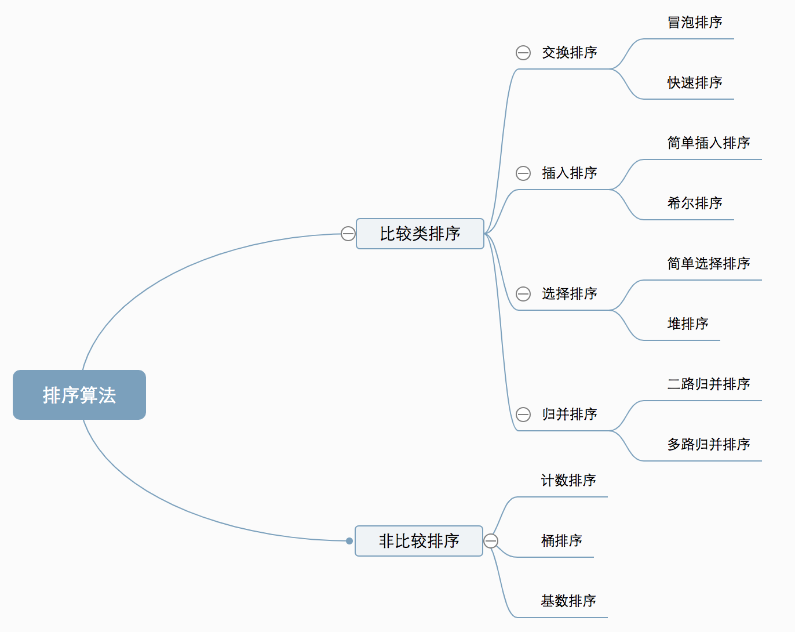

### 一、排序算法

[toc]

#### 1. 概述

##### 1.1 分类



##### 1.2 复杂度

- **是否稳定看交换元素是是否破坏原来的相对顺序。**


#### 2. 插入 vs 冒泡 vs 选择

##### 2.1 插入（稳定）


##### 2.2 冒泡（稳定）


##### 2.3 选择（不稳定）


#### 3. 快速排序

##### 3.1 图解


##### 3.2 C++

```c++
#include <algorithm> //std::sort C++
#include <utility>   // std::swap
using namespace std;

//快速排序C++实现
void quick_sort(vecotr<int>& a, int l, int r)
{
    if (l >= r) return;
    int i = l-1, j = r+1, k = a[l + (r-l)/2];
    while (i < j)
    {
        do i++; while (a[i] < k);
        do j--; while (k < a[j]);
        if (i < j) swap(a[i], a[j]);
    }
    quick_sort(a, l, j);
    quick_sort(a, j+1, r);
}
```


#### 4. 堆排序

##### 4.1 图解


##### 4.2 Python

```python
from heapq import heapify,heappush,heappop

#从heap[index]开始自顶向下调整堆,作为一个原子操作
#i: 表示开始调整的根节点，n: 堆大小
def down(heap, i):
    n = len(heap)
    l, r = i*2+1, i*2+2
    
    j = i # j为最小值索引
    if l<n and heap[l] < heap[i]: j = l
    if r<n and heap[r] < heap[i]: j = r
    
    if i != j:
        heap[i],heap[j] = heap[j], heap[i]
        heapify(heap, j, n)

```

##### 4.3 C++


```c++
#include<iostream> //make_heap,pop_heap,push_heap,sort_heap

void swap(vector<int>& arr,int l,int r){
    int tmp = arr[l];
    arr[l] = arr[r];
    arr[r] = tmp;
}
void heapify(vector<int>& heap, int index, int heap_size){
    int n = heap_size;
    int large = index, l = index*2+1, r = index*2+2;
    //小根堆
    if(l < n && heap[l] > heap[large]) large = l;
    if(r < n && heap[r] > heap[large]) large = r;
    
    if(large != index){
        swap(heap,index,large);
        heapify(heap, large, heap_size);
    }
}

void make_heap(vector<int>& heap){
    int n = heap.size();
    for(int i=(n-1)/2; i>-1; i--){
        heapify(heap, i, n);
    }
}

//小根堆降序排列
void heap_sort(vector<int>& heap){
    make_heap(heap);
    for(int i=heap.size()-1; i>0; i--){
        swap(heap,0,i);
        heapify(heap, 0, i);
    }
}

void heap_push(vector<int>& heap, int val){
    heap.push_back(val);
    int n = heap.size();
    int index = (n-1)/2;
    while(index >= 0){
        heapify(heap, index, n);
    }
}
int heap_pop(vector<int>& heap){
    int res = heap[0];
    swap(heap,0,heap.size()-1);
    heap.pop_back();
    heapify(heap, 0, heap.size());
    return res;
}
```


#### 5. 归并排序

##### 5.1 图解


##### 5.2 C++

```c++
//3. 归并排序
void merge(vector<int>& nums, int low, int mid, int high){
    vector<int> tmp;
    int i = low, j = mid+1;
    while(i<=mid && j<=high){
        if(nums[i]<=nums[j]) tmp.push_back(nums[i++]);
        else tmp.push_back(nums[j++]);
    }
    while(i<=mid){
        tmp.push_back(nums[i++]);
    }
    while(j<=high){
        tmp.push_back(nums[j++]);
    }
    for(int i=low;i<=high;i++){
        nums[i] = tmp[i-low];
    }
}
void merge_sort(vector<int>& nums, int left, int right){
    if(left < right){
        int mid = left + (right-left)/2;
        merge_sort(nums, left, mid);
        merge_sort(nums, mid+1, right);
        merge(nums, left, mid, right);
    }
}
```


#### 6. 桶排序 & 计数排序

##### 6.1 计数排序图解


##### 6.2 C++

```c++
//4. 桶排序、计数排序（k=1）
void bucket_sort(vector<int>& nums){
    int Max=0, Min=0;
    for(auto val: nums){
        Max = max(Max,val);
        Min = min(Min,val);
    }
    //k: 数字间间隔;len:桶长;bucket:桶子
    int k = 8;
    int len = (Max-Min)/k +1;
    vector<vector<int>> bucket(len);
    for(auto val: nums){
        bucket[(val-Min)/k].push_back(val);
    }

    int index=0;
    for(auto& arr: bucket){
        sort(arr.begin(),arr.end());
        for(int i=0;i<arr.size();i++){
            nums[index++] = arr[i];
        }
    }
    
}
```


#### 7. 基数排序

##### 7.1 图解


##### 7.2 C++

```c++
//5. 基数排序
//按某个位置进行一次入桶出桶,exp: 0,...k.表示pow(10,exp)
void digit_bucket(vector<int>& nums, int exp){
    vector<vector<int>> bucket(10);
    for(int& val: nums){
        int index = (val / (int)pow(10,exp))%10;
        bucket[index].push_back(val);
    }
    int i=0;
    for(auto arr: bucket){
        for(int val: arr){
            nums[i++] = val;
        } 
    }
}

void radix_sort(vector<int>& nums){
    int Max = 0;
    for(int val: nums) Max=max(Max,val);
    int exps = 1;
    while(Max/10!=0){
        Max /= 10;
        exps += 1;
    }
    for(int exp=0;exp<exps;exp++){
        digit_bucket(nums, exp);
    }
}

```


#### 8. 希尔排序

##### 8.1 图解


##### 8.2 C++

```c++
//6. 希尔排序，增量序列：pow(2,k)-1,...,15,7,3,1
//insert_k: 增量为 k 时插入排序
void insert_k(vector<int>& nums, int step){
    for(int i=0; i<step; i++){
        for(int j=i; j<nums.size(); j+=step){
            for(int k=j-step; k>=i && nums[k]>nums[k+step]; i-=step){
                swap(nums[k],nums[k+step]);
            }
        }
    }
}
void shell_sort(vector<int>& nums){
    vector<int> sequence;
    for(int i=1;pow(2,i)<nums.size()/2;i++){
        sequence.push_back(pow(2,i)-1);
    }
    for(int i=sequence.size()-1;i>-1;i--){
        insert_k(nums, sequence[i]);
    }
}
```


### 二、内置排序函数

#### 1. C++

[cplusplusreference](https://www.cplusplus.com/reference/algorithm/sort/?kw=sort)

```c++
#include<algorithm>  //sort()

//比较函数的写法
//方法一：声明外部比较函数或声明为静态函数
//当comp作为类的成员函数时，默认拥有一个this指针，这样和sort函数所需要使用的排序函数类型不一样。
bool Less(const Student& s1, const Student& s2)
{
    return s1.name < s2.name; //从小到大排序
}
sort(sutVector.begin(),sutVector.end(),Less);

//方法二：重载类的比较运算符
bool operator<(const Student& s1, const Student& s2)
{
    return s1.name < s2.name; //从小到大排序
}
sort(sutVector.begin(),sutVector.end());

//方法三：声明比较类
struct Less
{
    bool operator()(const Student& s1, const Student& s2)
    {
        return s1.name < s2.name; //从小到大排序
    }
};
sort(sutVector.begin(),sutVector.end(),Less());
```

#### 2. Python

##### 2.1 升/降序 和 lambda 函数

```python
# 对于列表 nums 原地降序排列，返回 None
# reverse 指明升/降序，key 为一个参数的函数名，可以是lambda函数
nums.sort(reverse = True, key = fun)

# 对于序列类型(list, tuple, range, str, set, dict), 返回 list
ls = sorted(itrable, reverse = True, key = fun)

# eg: 按 value 对字典进行排序
ls = sorted(dic.items(), key = lambda item: item[1])
```

##### 2.2 自定义\_\_lt\_\_

```python
# 对类自定义比较规则
class MyStr(str):
    def __lt__(self, other):
        return self + other < other + self

# nums: List[MyStr]
nums.sort()
```
