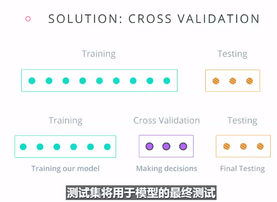
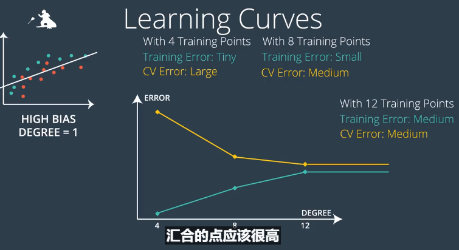
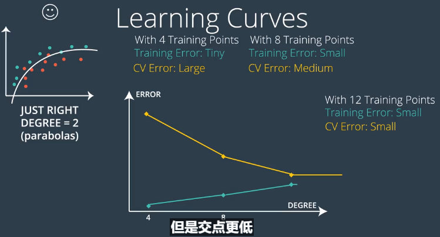
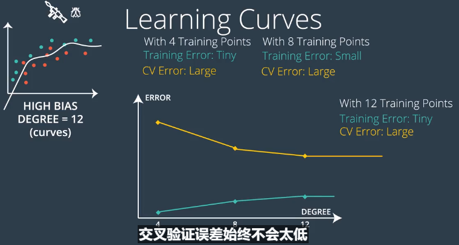
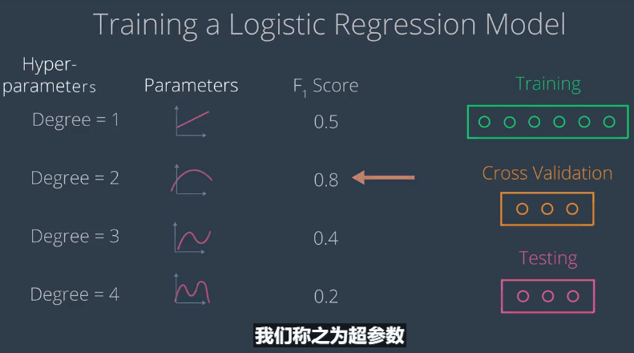

# Machine Learning

## 一、训练和测试模型

### 1.Pandas加载数据转化为numpy数组
```python
import numpy as np
import pandas as pd
data = pandas.read_csv("file_name.csv")
X = data[["x1","x2"]]#x1,x2，y为列索引
y = data["y"]
X = np.array(X)
y = np.array(y)
```
### 2.在scikit learn中训练模型
```python
#逻辑回归
from sklearn.linear_model import LogisticRegression
classifier = LogisticRegression()

#神经网络
from sklearn.neural_network import MLPClassifier
classifier = MLPClassifier()

#决策树
from sklearn.tree import DecisionTreeClassifier
classifier = DecisionTreeClassifier

#支持向量机
from sklearn.svm import SVC
classifier = SVC()
#classifier = SVC(kenel=None,degree=None,gamma=None,C=None)
#kernel:'linear'(线性),'poly'(多项式)，'rbf'(高斯核)
#degree:多项式内核的次数(如果选了多项式)
#gamma:\gamma参数(长得像y的希腊字符)
#C:C参数
```
```python
classifier.fiit(X,y)#训练分类器
```
### 3. 测试你的模型

- **模型的输出是离散值（discrete values），例如布尔值，那么我们将其称为分类模型。如果输出是连续值（continuous values），那么我们将其称为回归模型。**
- **训练集和测试集 **
```python
from sklearn.model_selection import train_test_split
X_train,X_test,y_train,y_test = train_test_split(X,y,test_size = 0.25)
#test_size表示测试集数据比例
```
- **黄金法则：不能用测试集进行训练。**

  

## 二、评估指标

### 1.混淆矩阵(confusion matrix)
|		None	|Guessed Positive	|Guessed Negative  |
|:-----:|:------:|:-----:|
|Positive(正样本，P)|True Positives(真阳性，TP)	|False Negatives(假阴性，FN)	|
|Negative(负样本，N)|False Positives(假阳性，FP)	|True Negatives(真阴性，TN)	|


### 2.准确率(Accuracy)
$$Accuracy =\frac{n_{correct} }{ n_{total}}=\frac{TP+TN}{P+N}$$


### 3.精确率(Precision)
$$Precision = \frac{TP}{TP+FP}$$


### 4.召回率(Recall)
$$Recall = \frac{TP}{TP+FN}$$

### 5.F1得分(F1 score)
F1 score是精确率和召回率的调和平均值，一般来说结果偏向于较小的值：
$$F1_{score}=\frac{2*precision*recalll}{precision+recall}$$


### 6.F-$\beta $ score
F-$\beta $ score根据$\beta$参数大小计算侧重于精确率或者召回率的调和平均数：
$$F_\beta = (1+\beta^2)*\frac{precision*recall}{\beta^2*precision+recall}$$

结论：$0<=\beta$
- 如果$\beta = 0$，得出精确率。
- 如果$\beta=\infty$，得出召回率。
- 对于 other values of $\beta$，如果接近0，则得出接近精确率的值；如果等于1，则得出F1 score 的值；如果很大，则得出接近召回率的值。

### 7.P-R曲线
- **横坐标召回率(Recall),纵坐标精确率(Precision)**

### 8.ROC曲线(受试者工作特性曲线)
- **假阳性率(False Positive Rate,FPR)**
$$FPR = \frac{FP}{N}$$
- **真阳性率(True Positive Rate,TPR)**
$$TPR = \frac{TP}{P}=Recall$$

- **曲线下的面积(Area Under Curve, AUC)**
AUC的值沿着ROC横轴做积分就可以计算了，取值一般在0.5~1之间。AUC越大，分类性能越好。

- **ROC曲线的横坐标是FPR，纵坐标是TPR。**


### 8.回归指标
- **平均绝对误差(Mean Absolute Error)**
$$\mid Y-Y_0\mid$$
```python
from sklearn.metrics import mean_absolute_error
form sklearn.linear_model import LinearRegression
classifier = LinearRegression()
calssifier.fit(X,y)

guesses = classifier.predict(X)
error = mean_absolute_error(y,guesses)
```
- **均方误差(Mean Squared Error)**
$$(Y-Y_0)^2$$
```python
from sklearn.metrics import mean_squared_error
error = mean_squared_error(y,guesses)
```
- **R2 Score**
$$R2_{Score} = 1-\frac{回归模型均方误差}{简单模型均方误差}$$
```python
from sklearn.matrics import r2_score
y_true = [1,2,4]
y_predict = [1.3,2.5,3.7]
re_sore(y_true,y_predict)
```

## 三、模型选择
### 1.偏差和方差(Bias and Variance)
- **Bias反映的是样本在模型上的输出与真实值之间的差距，即模型本身的准确度(Accuracy)**
- **Variance代表每次训练出来的模型各自的输出结果之间的方差**
- **欠拟合表现为偏差大，过拟合表现为方差大**


### 2.交叉验证(Cross Validation)

- 简单交叉验证的缺点是不能循环利用数据，下面介绍k折交叉验证
### 3.k折交叉验证(K-Fold Cross Validation)
- **K折交叉验证：把数据分成K份，每次拿出一份作为验证集(注意不是测试集，最后才用测试集！！！)，剩下K-1份作为训练集，重复K次。最后平均K次的结果，作为误差评估的结果。优势是只需要计算K次**
```python
from sklearn,model_selection import KFold
#12表示训练集数量，3表示训练集中验证集数量，shuffle=True随机化
kf = KFold(12,3,shuffle=True)
for train_indices,test_indices in kf:
	pass
```


### 4.学习曲线(Learning Curves)




- **图中CV Error 相当于Testing Error，即黄色曲线代表测试误差，绿色曲线代表训练误差。**


### 5.网格搜索(Grid Search)

- **网格搜索思想：遍历不同的超参数(Hyper-Parameters)，训练同一模型。以训练集(Training)和交叉验证集(Cross Validaton)在模型上的表现计算F1-Score，选择F1-Score最大的并在测试集(Testing)上表现OK的模型。**
- **常见算法对应的超参数：**
- 1.Logistic Regression -> Degree(多项式最高次)；
- 2.Decision Tree -> Depth(最大深度)；
- 3.SVM -> Kernel、gamma参数


