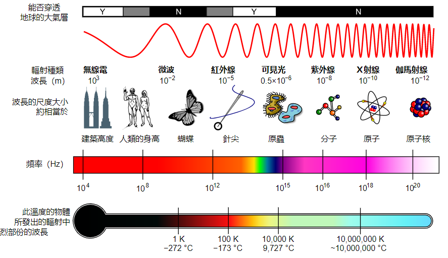
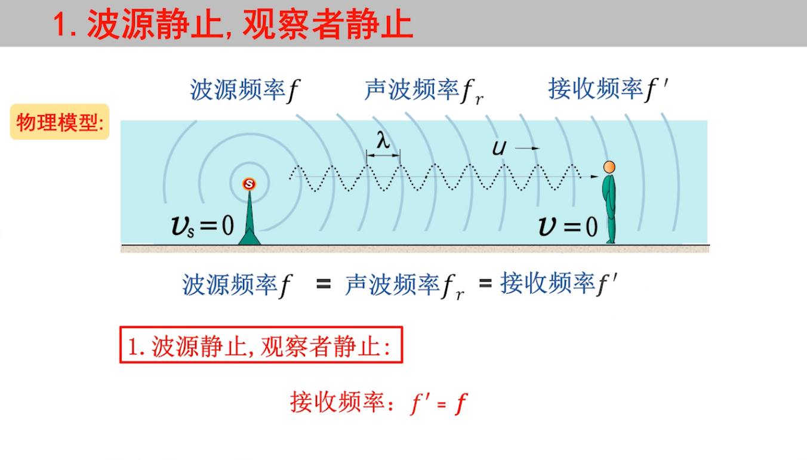
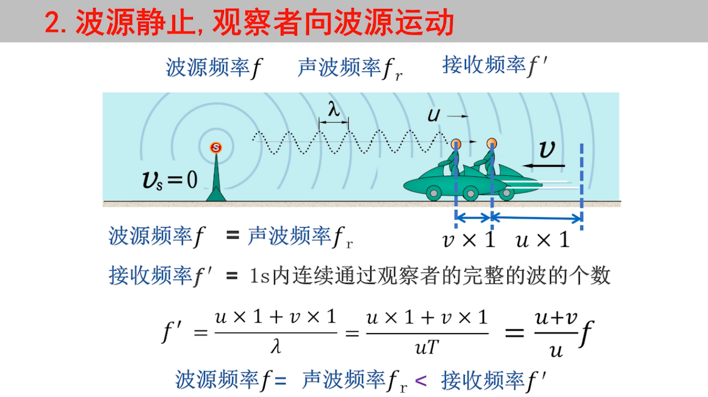
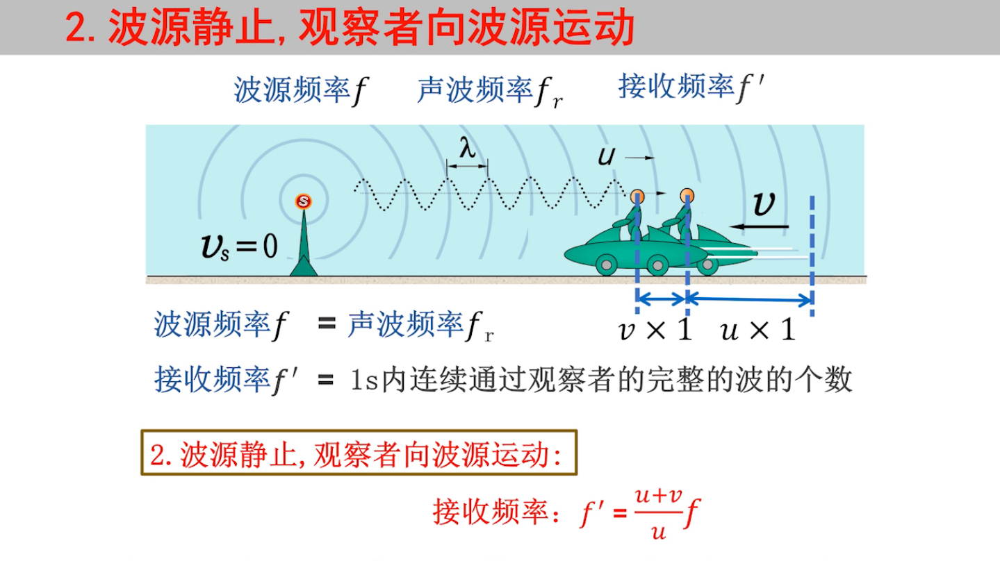
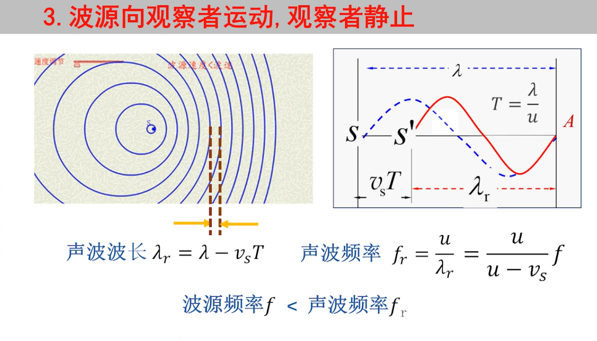
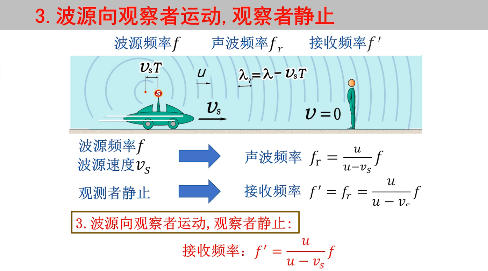
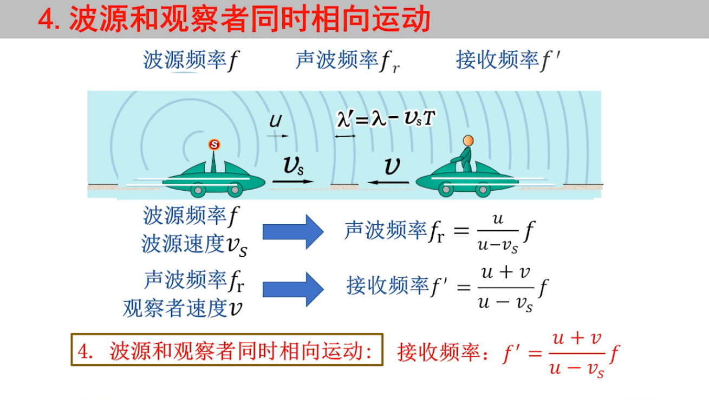

### 多普勒效应的基本原理

#### 1. 基础知识

- 波按性质分类：

    ```mermaid
    graph LR

    波 --> A(机械波)
    波 --> C(引力波)
    波 --> B(电磁波)
    波 --> D(物质波)
    A --> 水波,声波,地震波 --> 只在介质中传播 --> 超声波
    B --> 可见光,红外线... --> E(真空传播,速度恒为光速) 
    E --> LiDAR
    E --> Radar
    E --> Camera
    ```

- 电磁波谱图

  
  
- 定义、公式

  频率：单位时间内完成周期性变化的次数，$f$ (Hz)
  
  波长：波在一个振动周期内传播的距离，$\lambda$ (m)
  
  速度：波源速度$v_s$，声波速度$u$, 观察者速度$v$ (m/s)
  
  周期：完成一个周期变化的时间，$T$ (s)
  
  公式1：
  $$
  v= f\times\lambda
  $$
  公式2：
  $$
  T\times f = 1
  $$
  

#### 2. 多普勒频移关系推导













