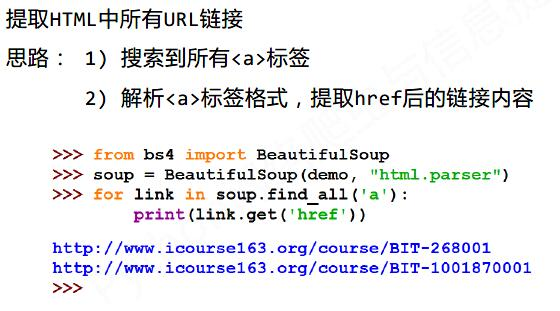

# 爬虫
[toc]
## 一、Requests入门
### 1.Requests库的7个主要方法

| requests.requests()  |  构造一个请求，支撑一下各种方法的基础方法 |  
| :-------- | --------:|
|  requests.get()      |   获取HTML网页的主要方法，对应HTTP的GET |
| requests.head()      | 获取HTML网页头信息的方法，对应HTTP的HEAD|
|requests.post()       | 向HTML网页提交POST请求的方法，对应POST  |
|requests.put()        | 向HTML网页提交PUT请求的方法，对应PUT    |
|requests.patch()      | 向HTML网页提交局部修改请求，对应PATCH   |
|requests.delete()     | 向HTML页面提交删除请求，对应HTTP的DELETE|

### 2.r = requests.get(url,params=None,**kwargs)

|   参数/对象 |    功能   | 
| :--------: | :--------| 
|    **r** |**返回的Response对象，包含服务器返回的所有内容和请求的Requests信息** | 
| **url**  |**拟获取页面的url链接**    |
|**params**|**url中额外参数，字典或字节流格式，可选**|
|**\*\*kwargs**|**12个控制访问参数**|

- **13个控制访问参数作用**
|   **kwargs |    描述   | 
| :--------: | :--------| 
| **params** |**字典或字节序列，作为参数增加到url中** | 
| **headers**|**字典，HTTP定制头，可模拟浏览器访问** |
|**timeout**|**设定超时时间，单位为秒**|
|**cookies**|**字典或CookieJar，Request中的cookie**|
|**data**|**字典、字节序列或文件对象，作为Request的内容**|
|**json**|**JSON格式的数据，作为Request的内容**|
|**proxies**|**字典类型，设定访问代理服务器，可增加登录认证**|
|**allow_redirects**|**True/False，默认为True，重定向开关**|
|**stream**|**True/False，默认为True，获取内容立即下载开关**|
|**auth**|**元组，支持HTTP认证功能**|
|**verify**|**True/False，默认为True，认证SSL证书开关**|
|**files**|**字典类型，传输文件**|
|**cert**|**本地SSL证书路径**|

#### params、headers的应用

    import requests
    url = 'http://www.baidu.com'
    try:
	    kv = {'user-agent':'Mozilla/5.0'}
	    kw = {'wd':'Python'}
	    r = requests.get(url,headers=kv,params=kw)
	    r.raise_for_status()
	    r.encoding = r.apparent_encoding
	    print(r.text)
	except:
		print("爬取失败")	   

 

### 3.Response对象的属性
|   属性      |    说明   | 
| :--------: | :--------| 
|**r.status_code** |**HTTP请求的返回状态，200表示连接成功，404表示连接失败** | 
| **r.text** |**HTTP响应内容的字符串形式，即url对应的页面内容**    |
|**r.headers**|**HTTP响应内容的头部信息** |
|**r.content** |**HTTP响应内容的二进制形式**|
|**r.encoding**|**从HTTP header中猜测的响应内容编码方式**|
|**r.apparent_encoding**|**从内容中分析出的响应内容编码方式**|
|**r.request.headers** | **请求的Request信息的头部**|
|**r.request.url** | **请求Request信息的url地址** |

|   属性/方法    |    说明   | 
| :--------: | :--------| 
|**r.status_code** |**HTTP请求的返回状态，200表示连接成功，404表示连接失败** |
|**r.raise_for_status()** |**如果不是200，产生requests.HTTPError,常用于异常处理** |

### 4.爬取网页的通用代码框架

    import requests
    def getHTMLText(url): 
	    try:
		    r = requests.get(url,timeout=30)
		    r.raise_for_status()#如果状态不是200，引发HTTPError异常
		    r.encoding = r.apparent_encoding
		    return r.text
		except:
			return "产生异常"
	if __name__ == "__main__":
		url = "http://www.baidu.com"
		print(getHTMLText(url))
### 5.Post方法（模拟登录）

    #以模拟登录python123.io为例
    import requests
    pass

- **需要用到三个参数url、data、headers**
- **url=''**

### 5.HTTP协议
- **HTTP，Hypertext  Transfer Protocol，超文本传输协议**
####  **URL格式： http://host[:port][path]**
|   字段      |    说明   | 
| :--------: | :--------| 
|**host** |**合法的Internet主机域名或IP地址** |
|**port**| **端口号，缺省端口为80**|
|**path**| **请求资源的路径**|

## 二、正则表达式
### 1.正则表达式常用操作符

| 操作符      |   说明    |   实例   |
| :--------: | :--------|  :------ |
| **.**     |   **表示任何单个字符** |   |
|**[ ]**|**字符集，对单个字符给出取值范围**|**[abc]表示a或b或c、[a-z]表示a到z单个字符**|
|**[^ ]**   |**字符集，对单个字符给出排除范围**|**[^abc]表示非a非b非c的单个字符** |
|**\***     |**前一个字符0次或无限次扩展** |**ab\*表示a、ab、abb、abbb、等** |
|**+**  |**前一个字符1次或者无限次扩展**  |**ab+表示ab、abb、abbb等** |
|**？** |**前一个字符0次或者1次扩展** |**abc?表示ab或abc**|
|**{m}**|**扩展前一个字符m次**| **ab{2}c表示abbc**|
|**{m,n}**|**扩展前一个字符m至n（[m,n]）次**|**ab{1,2}c表示abc或abbc**|
|**\|** |**左右表达式任意一个**  |**abc\|def表示abc或def** |
|**^** |**匹配字符串开头** | **^abc表示abc且在一个字符串的开头**|
|**\$** |**匹配字符串结尾** | **\$abc表示abc且在一个字符串的结尾** |
|**( )**|**分组标记，内部只能使用\|操作符**|**(abc)表示abc，(abc\|def)表示abc或def**|
|**\d** |**单个数字，等价于[0-9]** |
|**\W** |**单词字符，等价于[A-Za-z_0-9]**|
|**\s** |**匹配单个空白符，包括空格、换行、tab缩进等** |
|**\S** |**匹配单个非空白，\s的对立面**|

### 2.经典正则表达式实例

| 表达式     |    描述    |  
| :-------- | :-------- | 
|**^[a-zA-Z]+$**    |   **由26个字母组成的字符串** |  
|**^[a-zA-Z0-9]+$** |  **由26个字母和数字组成的字符串**|
|**^-?\d+$** 	| **整数形成的字符串**  |
|**^[0-9]\*[1-9][0-9]\*$**	| **正整数形成的字符串**   |
|	**[1-9]\d{5}**		| **中国境内邮政编码，6位**     |
|**[\u4e00-\u9fa5]**	|**匹配中文字符**			|
|**\d{3}-\d{8}\|\d{4}-\d{7}**|**国内电话号码，010-68913536** |

### 3.Re库主要功能函数

| 函数	    |     功能  |  
| :-------- | :-------- | 
|**re.findall()**| **搜索字符串，以列表类型返回全部能匹配的子串**|
|**re.split()**  |**将一个字符串以正则表达式匹配内容进行分割，返回列表类型**|
|**re.sub()**    |**在一个字符串中替换所有匹配正则表达式的字串**|

## 三、Beautiful Soup
### 1.Beautiful Soup库解析器

    import requests
    from bs4 import BeautifulSoup
    r = requests.get('http://www.baidu.com')
    soup = BeautifulSoup(r.text,'html.parser')
**soup = BeautifulSoup(r.text,'html.parser')**
**soup是BeautifulSoup类的实例对象，'html.parser'指出解析方法**

| 解析器     |  使用方法 |  条件     |
| :-------- | :--------| :------- |
| bs4的HTML解析器	|BeautifulSoup(mk,'html.parser')|安装bs4库	|
| lxml的HTML解析器	|BeautifulSoup(mk,'lxml')		|pip install lxml|
| lxml的XML解析器	|BeautifulSoup(mk,'xml')		|pip install lxml|
| html5lib的解析器	|BeautifulSoup(mk,'html5lib')	|pip install html5lib|
### 2.BeautifulSoup类的标签（soup.Tag）
**Tag，最基本的信息组织元素，分别用<>和</>标明开头和结尾**
**任何存在于HTML语法中的标签都可以用soup.<tag>访问获得，当HTML文档中存在多个相同的<tag>对应的内容时，soup.tag返回第一个标签**

    import requests
    from bs4 import BeautifulSoup
    r = requests.get('http://www.baidu.com')
    r.encoding = r.apparent_encoding
    soup = BeautifulSoup(r.text,'html.parser')
    tag = soup.a
    print(tag)
    #打印结果：<a calss="mnav" href="http://news.baidu.com" name="tj_trnews">新闻</a>
    
### 3.BeautifulSoup类标签的属性（soup.Tag.Attribute）

| 基本元素   |     说明   | 格式	   	|  
| :-------- | :-------- | :-----    |
| Name		|标签的名字  	|tag.name	|
|Attributes	|标签的属性	|tag.attrs	|
|NavigableString|标签内非属性字符串|tag.string|
|Comment	|标签内字符串的注释部分|  |

    import requests
    from bs4 import BeautifulSoup
    r = requests.get('http://www.baidu.com')
    r.encoding = r.apparent_encoding
    soup = BeautifulSoup(r.text,'html.parser')
    tag = soup.a
    #tag：<a calss="mnav" href="http://news.baidu.com" name="tj_trnews">新闻</a>
    tag.name #'a'
    tag.string #新闻
    tag.attrs 
    #{'href':'http://www.baidu.com','name':'tj_trnews','class':['mnav']}
    
### 4,基于bs4库的HTML内容遍历（soup.Tag.Attribute）

| 属性      |     说明   |  
| :-------- | :-------- | 
| tag.contents	|子节点的列表，将tag所有儿子节点存入列表	|
| tag.children	|子节点的迭代类型，与tag.contents类似，用于循环遍历 儿子节点|
| tag.descendants|子孙节点的迭代类型，包含所有子孙节点，用于循环遍历		|
| tag.parent	|子节点的父亲标签		|
| tag.parents	|子节点先辈标签的迭代类型，用于循环遍历先辈节点				|
|tag.next_sibling	|返回按照HTML文本顺序的下一个平行节点标签				|
|tag.previous_sibling|返回按照HTML文本顺序的上一个平行节点标签			|
|tag.next_siblings	|迭代类型，返回按照HTML文本顺序的后续所有平行节点标签	|
|tag.previous_siblings|迭代类型，返回按照HTML文本顺序的前序所有平行节点标签	|

### 5.bs4的prettify()和编码
- **soup.prettify()或者tag.prettify()，为HTML文本<>及其内容增加'\n'，使其显示更直观友好，可以类比Linux终端的tree(<file_name>)命令。**
- **bs4库将任何HTML输入都变成utf-8编码，Python 3.x默认支持编码是utf-8，解析无障碍。**

### 6.基于bs4库的HTML内容查找方法
#### （1）实例

#### （2）find_all方法
**< >.find_all（name，attrs，recursive，string，\*\*kwargs）返回一个列表类型，存储查找结果**
- **name：对标签名称的检索字符串**
- **attrs：对标签属性值的检索字符串，可标注属性检索**
- **recursive：是否对子孙全部检索，默认为True**
- **string：< >...</>中字符串区域的检索字符串**

	#对soup的子孙标签检索<a>...</a>标签
	soup.find_all('a')
	
	#对soup的子孙标签检索a，b标签
	soup.find_all(['a','b'])
	
	#检索soup所有子孙标签
	soup.find_all(True)
	
	#检索键值对属性中含value为'course'的p标签
	soup.find_all('p','course')
	
	#检索键值对属性中key，value分别为id和'link1'的标签
	soup.find_all(id='link1')
	
	#对soup的子节点检索<a>...</a>标签
	soup.find_all('a',recursive=False)
	
	#对标签内非属性字符串string='Basic Python'的检索，返回类似字符串列表['Basic Python']
	soup.find_all(string='Basic Python')
- **以上操作都可以引入正则表达式，具体是将参数'parameter1'替换为re.compile('parameter2')**	

#### （3）find_all扩展方法

## 四、Scrapy框架

### 1.Scrapy常用命令
| 命令      |      说明 |    格式   |
| :-------- | --------:| :------: |
|**startproject**|**创建一个工程**|**scrapy startproject <`name> [dir]** |
|**genspider**   |**创建一个爬虫**|**scrapy genspider [options] <`name> <.domain>**|
|**settings**    |**获取爬虫配置信息**|**scrapy settings [options]** |
|**crawl**       |**运行一个爬虫** |**scrapy crawl <`spider>**  |
|**list**        |**列出工程中所有爬虫**|**scrapy list**|
|**shell**       |**启动URL命令行**  |**scrapy shell [url]**|

### 2.Scrapy第一个实例
##### Step1：建立一个Scrapy爬虫工程（目录名：~）

    ~>scrapy startproject python123demo
##### Step2：在工程中产生一个Scrapy爬虫（目录：~/python123demo）

    #产生一个名为demo的spider，在spider目录下增加代码文件demo.py
    ~/python123demo>scrapy genspider demo python123.io
    
##### Step3：配置产生的spider爬虫（修改demo.py文件：初始化URL地址，添加解析方式）

    #demo.py的标准版本
    import scrapy
    class DemoSpider(scrapy.Spider):
	    name = 'demo'
		def start_requests(self):
			urls = ['http://python123.io/ws/demo.html']
			for url in urls:
				yield scrapy.Request(url=url,callback=self.parse)
		def parse(self,response):
			fname = response.url.split('/')[-1]
			with open(fname,'wb') as f:
				f.write(response.body)
			self.log('Saved file %s.' % fname)
			
### 3.Scrapy爬虫的数据类型
#### （1）Request类
- **class scrapy.http.Request()**
- **Request对象表示一个HTTP请求，由Spider生成，由Downloader执行**

| 属性或方法      |    说明  | 
| :--------     | :--------| 
| **.url**      | **Request对应的请求URL地址** |
| **.method**   | **对应的请求方法，'GET' 'POST'等**|
| **.headers**  | **字典类型风格的请求头**|
| **.body**		| **请求内容主体，字符串类型**|
| **.meta**		| **用户添加的扩展信息，在Scrapy内部模块间传递信息使用**|
| **.copy**		| **复制该请求**  |

#### （2）Response类
- **class scrapy.http.Response()**
- **Response对象表示一个HTTP响应由Downloader生成，由Spider处理**

| 属性或方法      |    说明  | 
| :--------     | :--------| 
| **.url**      | **Response对应的URL地址** |
| **.status**   | **HTTP状态码，默认是200**|
| **.headers**  | **Response对应的头部信息**|
| **.body**		| **Response对应的内容信息，字符串类型**|
| **.flags**	| **一组标记**|
| **.request**	| **产生Response类型对应的Request对象**|
| **.copy**		| **复制该响应**  |

#### （3）Item类
- **class scrapy.item.Item()**
- **Item对象表示一个从HTML页面中提取的信息内容。由Spider生成，由Item Pipeline处理。Item类似字典类型，可以按照字典类型操作**
-

