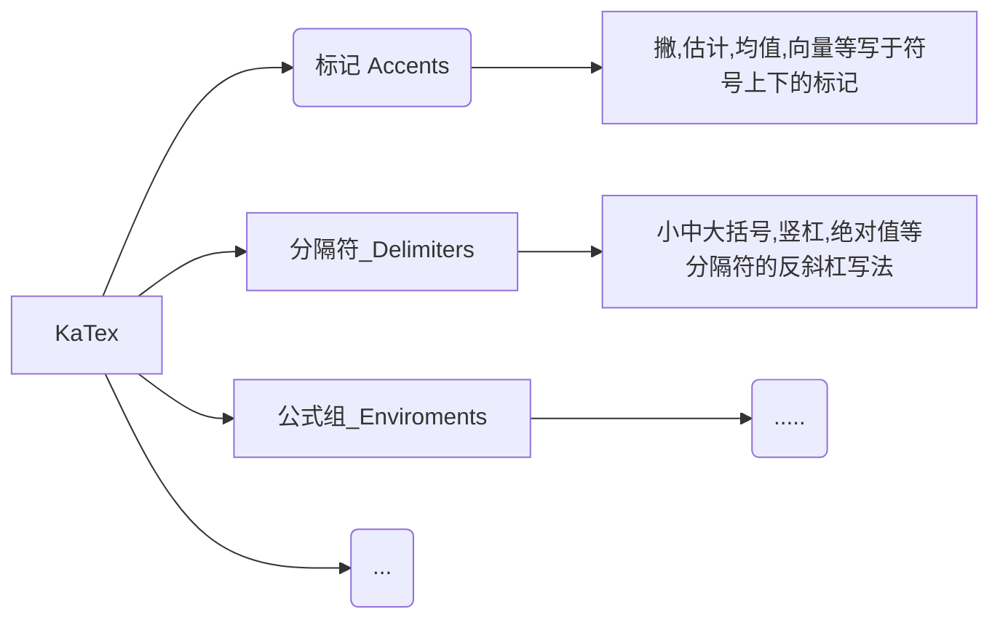

# Markdown 简明语法

---

### 1. 斜体和粗体

使用 * 和 ** 表示斜体和粗体。

示例：

这是 *斜体*，这是 **粗体**。

### 2. 分级标题

使用 === 表示一级标题，使用 --- 表示二级标题。

示例：

```
这是一个一级标题
============================

这是一个二级标题
--------------------------------------------------

### 这是一个三级标题
```

你也可以选择在行首加井号表示不同级别的标题 (H1-H6)，例如：# H1, ## H2, ### H3，#### H4。

### 3. 外链接

使用 \[描述](链接地址) 为文字增加外链接。

示例：

这是去往 [本人博客](http://ghosertblog.github.com) 的链接。

### 4. 无序列表

使用 *，+，- 表示无序列表。

示例：

- 无序列表项 一
- 无序列表项 二
- 无序列表项 三

### 5. 有序列表

使用数字和点表示有序列表。

示例：

1. 有序列表项 一
2. 有序列表项 二
3. 有序列表项 三

### 6. 文字引用

使用 > 表示文字引用。

示例：

> 野火烧不尽，春风吹又生。

### 7. 行内代码块

使用 \`代码` 表示行内代码块。

示例：

让我们聊聊 `html`。

### 8.  代码块

使用 四个缩进空格 表示代码块。

示例：

    这是一个代码块，此行左侧有四个不可见的空格。

### 9.  插入图像

使用 \!\[描述](图片链接地址) 插入图像。

示例：


# Markdown 高阶语法

### 1. 内容目录

在段落中填写 `[TOC]` 以显示全文内容的目录结构。


### 2. 标签分类

在编辑区任意行的列首位置输入以下代码给文稿标签：

标签： 数学 英语 Markdown

或者

Tags： 数学 英语 Markdown

### 3. 删除线

使用 ~~ 表示删除线。

~~这是一段错误的文本。~~

### 4. 注脚

使用 [^keyword] 表示注脚。

这是一个注脚[^footnote]的样例。

这是第二个注脚[^footnote2]的样例。

### 5. LaTeX 公式

$ 表示行内公式： 

质能守恒方程可以用一个很简洁的方程式 $E=mc^2$ 来表达。

$$ 表示整行公式：

$$\sum_{i=1}^n a_i=0$$

$$f(x_1,x_x,\ldots,x_n) = x_1^2 + x_2^2 + \cdots + x_n^2 $$

$$\sum^{j-1}_{k=0}{\widehat{\gamma}_{kj} z_k}$$

访问 [MathJax](http://meta.math.stackexchange.com/questions/5020/mathjax-basic-tutorial-and-quick-reference) 参考更多使用方法。

### 6. 加强的代码块

支持四十一种编程语言的语法高亮的显示，行号显示。

非代码示例：

```
$ sudo apt-get install vim-gnome
```

Python 示例：

```python
@requires_authorization
def somefunc(param1='', param2=0):
    '''A docstring'''
    if param1 > param2: # interesting
        print 'Greater'
    return (param2 - param1 + 1) or None

class SomeClass:
    pass

>>> message = '''interpreter
... prompt'''
```

JavaScript 示例：

``` javascript
/**
* nth element in the fibonacci series.
* @param n >= 0
* @return the nth element, >= 0.
*/
function fib(n) {
  var a = 1, b = 1;
  var tmp;
  while (--n >= 0) {
    tmp = a;
    a += b;
    b = tmp;
  }
  return a;
}

document.write(fib(10));
```

### 7. 流程图

#### 示例

```flow
st=>start: Start:>https://www.zybuluo.com
io=>inputoutput: verification
op=>operation: Your Operation
cond=>condition: Yes or No?
sub=>subroutine: Your Subroutine
e=>end

st->io->op->cond
cond(yes)->e
cond(no)->sub->io
```

#### 更多语法参考：[流程图语法参考](http://adrai.github.io/flowchart.js/)

### 8. 序列图

#### 示例 1

```seq
Alice->Bob: Hello Bob, how are you?
Note right of Bob: Bob thinks
Bob-->Alice: I am good thanks!
```

#### 示例 2

```seq
Title: Here is a title
A->B: Normal line
B-->C: Dashed line
C->>D: Open arrow
D-->>A: Dashed open arrow
```

#### 更多语法参考：[序列图语法参考](http://bramp.github.io/js-sequence-diagrams/)

### 9. 甘特图

甘特图内在思想简单。基本是一条线条图，横轴表示时间，纵轴表示活动（项目），线条表示在整个期间上计划和实际的活动完成情况。它直观地表明任务计划在什么时候进行，及实际进展与计划要求的对比。

```gantt
    title 项目开发流程
    section 项目确定
        需求分析       :a1, 2016-06-22, 3d
        可行性报告     :after a1, 5d
        概念验证       : 5d
    section 项目实施
        概要设计      :2016-07-05  , 5d
        详细设计      :2016-07-08, 10d
        编码          :2016-07-15, 10d
        测试          :2016-07-22, 5d
    section 发布验收
        发布: 2d
        验收: 3d
```

#### 更多语法参考：[甘特图语法参考](https://knsv.github.io/mermaid/#gant-diagrams)

### 10. Mermaid 流程图

```graphLR
A[Hard edge] -->|Link text| B(Round edge)
B --> C{Decision}
C -->|One| D[Result one]
C -->|Two| E[Result two]
```

#### 更多语法参考：[Mermaid 流程图语法参考](https://knsv.github.io/mermaid/#flowcharts-basic-syntax)

### 11. Mermaid 序列图



```mermaid
graph TD
	A(工业用地效率)-->B1(土地利用强度)
	A-->B2(土地经济效益)
	B1-->C1(容积率)
	B1-->C2(建筑系数)
	B1-->C3(亩均固定资本投入)
	B2-->D1(亩均工业产值)
	B2-->D2(亩均税收)   Alice->John: Hello John, how are you?
    loop every minute
        John-->Alice: Great!
    end
```

#### 更多语法参考：[Mermaid 序列图语法参考](https://knsv.github.io/mermaid/#sequence-diagrams)

### 12. 表格支持

| 项目        | 价格   |  数量  |
| --------   | -----:  | :----:  |
| 计算机     | \$1600 |   5     |
| 手机        |   \$12   |   12   |
| 管线        |    \$1    |  234  |


### 13. 定义型列表

名词 1
:   定义 1（左侧有一个可见的冒号和四个不可见的空格）

代码块 2
:   这是代码块的定义（左侧有一个可见的冒号和四个不可见的空格）

        代码块（左侧有八个不可见的空格）

### 14. Html 标签

本站支持在 Markdown 语法中嵌套 Html 标签，譬如，你可以用 Html 写一个纵跨两行的表格：

    <table>
        <tr>
            <th rowspan="2">值班人员</th>
            <th>星期一</th>
            <th>星期二</th>
            <th>星期三</th>
        </tr>
        <tr>
            <td>李强</td>
            <td>张明</td>
            <td>王平</td>
        </tr>
    </table>


<table>
    <tr>
        <th rowspan="2">值班人员</th>
        <th>星期一</th>
        <th>星期二</th>
        <th>星期三</th>
    </tr>
    <tr>
        <td>李强</td>
        <td>张明</td>
        <td>王平</td>
    </tr>
</table>

### 15. 内嵌图标

本站的图标系统对外开放，在文档中输入

    <i class="icon-weibo"></i>

即显示微博的图标： <i class="icon-weibo icon-2x"></i>

替换 上述 `i 标签` 内的 `icon-weibo` 以显示不同的图标，例如：

    <i class="icon-renren"></i>

即显示人人的图标： <i class="icon-renren icon-2x"></i>

更多的图标和玩法可以参看 [font-awesome](http://fortawesome.github.io/Font-Awesome/3.2.1/icons/) 官方网站。

### 16. 待办事宜 Todo 列表

使用带有 [ ] 或 [x] （未完成或已完成）项的列表语法撰写一个待办事宜列表，并且支持子列表嵌套以及混用Markdown语法，例如：

    - [ ] **Cmd Markdown 开发**
        - [ ] 改进 Cmd 渲染算法，使用局部渲染技术提高渲染效率
        - [ ] 支持以 PDF 格式导出文稿
        - [x] 新增Todo列表功能 [语法参考](https://github.com/blog/1375-task-lists-in-gfm-issues-pulls-comments)
        - [x] 改进 LaTex 功能
            - [x] 修复 LaTex 公式渲染问题
            - [x] 新增 LaTex 公式编号功能 [语法参考](http://docs.mathjax.org/en/latest/tex.html#tex-eq-numbers)
    - [ ] **七月旅行准备**
        - [ ] 准备邮轮上需要携带的物品
        - [ ] 浏览日本免税店的物品
        - [x] 购买蓝宝石公主号七月一日的船票

对应显示如下待办事宜 Todo 列表：
        
- [ ] **Cmd Markdown 开发**
    - [ ] 改进 Cmd 渲染算法，使用局部渲染技术提高渲染效率
    - [ ] 支持以 PDF 格式导出文稿
    - [x] 新增Todo列表功能 [语法参考](https://github.com/blog/1375-task-lists-in-gfm-issues-pulls-comments)
    - [x] 改进 LaTex 功能
        - [x] 修复 LaTex 公式渲染问题
        - [x] 新增 LaTex 公式编号功能 [语法参考](http://docs.mathjax.org/en/latest/tex.html#tex-eq-numbers)
- [ ] **七月旅行准备**
    - [ ] 准备邮轮上需要携带的物品
    - [ ] 浏览日本免税店的物品
    - [x] 购买蓝宝石公主号七月一日的船票
      
        
[^footnote]: 这是一个 *注脚* 的 **文本**。

[^footnote2]: 这是另一个 *注脚* 的 **文本**。


# Latex 公式速查

| 符号                                           | 代码                                           | 描述       |
| ---------------------------------------------- | ---------------------------------------------- | ---------- |
| $\sum$                                         | `$\sum$`                                       | 求和公式   |
| $\sum_{i=0}^n$                                 | `$\sum_{i=0}^n$`                               | 求和上下标 |
| $\times$                                       | `$\times$`                                     | 乘号       |
| $\pm$                                          | `$\pm$`                                        | 正负号     |
| $\div$                                         | `$\div$`                                       | 除号       |
| $\mid$                                         | `$\mid$`                                       | 竖线       |
| $\cdot$                                        | `$\cdot$`                                      | 点         |
| $\circ$                                        | `$\circ$`                                      | 圈         |
| $\ast $                                        | `$\ast $`                                      | 星号       |
| $\bigotimes$                                   | `$\bigotimes$`                                 | 克罗内克积 |
| $\bigoplus$                                    | `$\bigoplus$`                                  | 异或       |
| $\leq$                                         | `$\leq$`                                       | 小于等于   |
| $\geq$                                         | `$\geq$`                                       | 大于等于   |
| $\neq$                                         | `$\neq$`                                       | 不等于     |
| $\approx$                                      | `$\approx$`                                    | 约等于     |
| $\prod$                                        | `$\prod$`                                      | N元乘积    |
| $\coprod$                                      | `$\coprod$`                                    | N元余积    |
| $\cdots$                                       | `$\cdots$`                                     | 省略号     |
| $\int$                                         | `$\int$`                                       | 积分       |
| $\iint$                                        | `$\iint$`                                      | 双重积分   |
| $\oint$                                        | `$\oint$`                                      | 曲线积分   |
| $\infty$                                       | `$\infty$`                                     | 无穷       |
| $\nabla$                                       | `$\nabla$`                                     | 梯度       |
| $\because$                                     | `$\because$`                                   | 因为       |
| $\therefore$                                   | `$\therefore$`                                 | 所以       |
| $\forall$                                      | `$\forall$`                                    | 任意       |
| $\exists$                                      | `$\exists$`                                    | 存在       |
| $\not=$                                        | `$\not=$`                                      | 不等于     |
| $\not>$                                        | `$\not>$`                                      | 不大于     |
| $\leq$                                         | `$\leq$`                                       | 小于等于   |
| $\geq$                                         | `$\geq$`                                       | 大于等于   |
| $\not\subset$                                  | `$\not\subset$`                                | 不属于     |
| $\emptyset$                                    | `$\emptyset$`                                  | 空集       |
| $\in$                                          | `$\in$`                                        | 属于       |
| $\notin$                                       | `$\notin$`                                     | 不属于     |
| $\subset$                                      | `$\subset$`                                    | 子集       |
| $\subseteq$                                    | `$\subseteq$`                                  | 真子集     |
| $\bigcup$                                      | `$\bigcup$`                                    | 并集       |
| $\bigcap$                                      | `$\bigcap$`                                    | 交集       |
| $\bigvee$                                      | `$\bigvee$`                                    | 逻辑或     |
| $\bigwedge$                                    | `$\bigwedge$`                                  | 逻辑与     |
| $\biguplus$                                    | `$\biguplus$`                                  | 多重集     |
| $\bigsqcup$                                    | `$\bigsqcup$`                                  |            |
| $\hat{y}$                                      | `$\hat{y}$`                                    | 期望值     |
| $\check{y}$                                    | `$\check{y}$`                                  |            |
| $\breve{y}$                                    | `$\breve{y}$`                                  |            |
| $\overline{a+b+c+d}$                           | `$\overline{a+b+c+d}$`                         | 平均值     |
| $\underline{a+b+c+d}$                          | `$\underline{a+b+c+d}$`                        |            |
| $\overbrace{a+\underbrace{b+c}_{1.0}+d}^{2.0}$ | `\overbrace{a+\underbrace{b+c}_{1.0}+d}^{2.0}` |            |
| $\uparrow$                                     | `$\uparrow$`                                   | 向上       |
| $\downarrow$                                   | `$\downarrow$`                                 | 向下       |
| $\Uparrow$                                     | `$\Uparrow$`                                   |            |
| $\Downarrow$                                   | `$\Downarrow$`                                 |            |
| $\rightarrow$                                  | `$\rightarrow$`                                | 向右       |
| $\leftarrow$                                   | `$\leftarrow$`                                 | 向左       |
| $\Rightarrow$                                  | `$\Rightarrow$`                                | 向右箭头   |
| $\Longleftarrow$                               | `$\Longleftarrow$`                             | 向左长箭头 |
| $\longleftarrow$                               | `$\longleftarrow$`                             | 向左单箭头 |
| $\longrightarrow$                              | `$\longrightarrow$`                            | 向右长箭头 |
| $\Longrightarrow$                              | `$\Longrightarrow$`                            | 向右箭头   |
| $\alpha$                                       | `$\alpha$`                                     |            |
| $\beta$                                        | `$\beta$`                                      |            |
| $\gamma$                                       | `$\gamma$`                                     |            |
| $\Gamma$                                       | `$\Gamma$`                                     |            |
| $\delta$                                       | `$\delta$`                                     |            |
| $\Delta$                                       | `$\Delta$`                                     |            |
| $\epsilon$                                     | `$\epsilon$`                                   |            |
| $\varepsilon$                                  | `$\varepsilon$`                                |            |
| $\zeta$                                        | `$\zeta$`                                      |            |
| $\eta$                                         | `$\eta$`                                       |            |
| $\theta$                                       | `$\theta$`                                     |            |
| $\Theta$                                       | `$\Theta$`                                     |            |
| $\vartheta$                                    | `$\vartheta$`                                  |            |
| $\iota$                                        | `$\iota$`                                      |            |
| $\pi$                                          | `$\pi$`                                        |            |
| $\phi$                                         | `$\phi$`                                       |            |
| $\Phi$                                         | `$\Phi$`                                       |            |
| $\psi$                                         | `$\psi$`                                       |            |
| $\Psi$                                         | `$\Psi$`                                       |            |
| $\omega$                                       | `$\omega$`                                     |            |
| $\Omega$                                       | `$\Omega$`                                     |            |
| $\chi$                                         | `\chi`                                         |            |
| $\rho$                                         | `$\rho$`                                       |            |
| $\omicron$                                     | `$\omicron$`                                   |            |
| $\sigma$                                       | `$\sigma$`                                     |            |
| $\Sigma$                                       | `$\Sigma$`                                     |            |
| $\nu$                                          | `$\nu$`                                        |            |
| $\xi$                                          | `$\xi$`                                        |            |
| $\tau$                                         | $\tau$                                         |            |
| $\lambda$                                      | $\lambda$                                      |            |
| $\Lambda$                                      | $\Lambda$                                      |            |
| $\mu$                                          | \mu                                            |            |
| $\partial$                                     | `$\partial$`                                   |            |
| $\lbrace \rbrace$                              | `$\lbrace \rbrace$`                            |            |
| $\overline{a}$                                 | `$\overline{a}$`                               |            |

# LaTeX 公式

## 加帽子符号

latex中如果想在字母上加上一个帽子（尖角）符号应该怎样表达呢？

（1）如果是在正文中，例如用\^{Z}即可；

（2）如果是在公式中，例如用\hat{Z}即可。

## 加横线和波浪线

加^号 输入\hat  或 \widehat

加横线 输入 \overline

加波浪线 输入 \widetilde

加一个点 \dot{要加点的字母}加两个点\ddot{要加点的字母}

## 其它特殊符号

### 声调

| 语法         | 效果                                                         | 语法         | 效果                                                         | 语法           | 效果                                                         |
| :----------- | :----------------------------------------------------------- | :----------- | :----------------------------------------------------------- | :------------- | :----------------------------------------------------------- |
| \bar{x}      |  | \acute{\eta} |  | \check{\alpha} |  |
| \grave{\eta} |  | \breve{a}    |  | \ddot{y}       |  |
| \dot{x}      |  | \hat{\alpha} |  | \tilde{\iota}  |  |

### 函数

| 语法                                                         | 效果                                                         | 语法                  | 效果                                                         | 语法                  | 效果                                                         |
| :----------------------------------------------------------- | :----------------------------------------------------------- | :-------------------- | :----------------------------------------------------------- | :-------------------- | :----------------------------------------------------------- |
| \sin\theta                                                   |  | \cos\theta            |  | \tan\theta            |  |
| \arcsin\frac{L}{r}                                           |  | \arccos\frac{T}{r}    |  | \arctan\frac{L}{T}    |  |
| \sinh g                                                      |  | \cosh h               |  | \tanh i               |  |
| \operatorname{sh}j                                           |  | \operatorname{argsh}k |  | \operatorname{ch}h    |  |
| \operatorname{argch}l                                        |  | \operatorname{th}i    |  | \operatorname{argth}m |  |
| k'(x)=\lim_{\Delta x\to 0}\frac{k(x)-k(x-\Delta x)}{\Delta x} |  | \limsup S             |  | \liminf I             |  |
| \max H                                                       |  | \min L                |  | \inf s                |  |
| \sup t                                                       |  | \exp\!t               |  | \ln X                 |  |
| \lg X                                                        |  | \log X                |  | \log_\alpha X         |  |
| \ker x                                                       |  | \deg x                |  | \gcd(T,U,V,W,X)       |  |
| \Pr x                                                        |  | \det x                |  | \hom x                |  |
| \arg x                                                       |  | \dim x                |  | \lim_{t\to n}T        |  |

### 同余

| 语法     | 效果                                                         | 语法      | 效果                                                         |
| :------- | :----------------------------------------------------------- | :-------- | :----------------------------------------------------------- |
| \pmod{m} |  | a \bmod b |  |

### 微分

| 语法   | 效果                                                         | 语法       | 效果                                                         | 语法        | 效果                                                         |
| :----- | :----------------------------------------------------------- | :--------- | :----------------------------------------------------------- | :---------- | :----------------------------------------------------------- |
| \nabla |  | \partial x |  | \mathrm{d}x |  |
| \dot x |  | \ddot y    |  |             |                                                              |

### 集合

| 语法      | 效果                                                         | 语法        | 效果                                                         | 语法      | 效果                                                         | 语法      | 效果                                                         | 语法        | 效果                                                         |
| :-------- | :----------------------------------------------------------- | :---------- | :----------------------------------------------------------- | :-------- | :----------------------------------------------------------- | :-------- | :----------------------------------------------------------- | :---------- | :----------------------------------------------------------- |
| \forall   |  | \exists     |  | \empty    |  | \emptyset |  | \varnothing |  |
| \in       |  | \ni         |  | \not\in   |  | \notin    |  | \subset     |  |
| \subseteq |  | \supset     |  | \supseteq |  | \cap      |  | \bigcap     |  |
| \cup      |  | \bigcup     |  | \biguplus |  | \sqsubset |  | \sqsubseteq |  |
| \sqsupset |  | \sqsupseteq |  | \sqcap    |  | \sqcup    |  | \bigsqcup   |  |

### 逻辑

| 语法          | 效果                                                         | 语法   | 效果                                                         | 语法      | 效果                                                         | 语法           | 效果                                                         |
| :------------ | :----------------------------------------------------------- | :----- | :----------------------------------------------------------- | :-------- | :----------------------------------------------------------- | :------------- | :----------------------------------------------------------- |
| p             |  | \land  |  | \wedge    |  | \bigwedge      |  |
| \bar{q} \to p |  | \lor   |  | \vee      |  | \bigvee        |  |
| \lnot         |  | \neg q |  | \setminus |  | \smallsetminus |  |

### 根号

| 语法     | 效果                                                         | 语法        | 效果                                                         |
| :------- | :----------------------------------------------------------- | :---------- | :----------------------------------------------------------- |
| \sqrt{3} |  | \sqrt[n]{3} | ![\pagecolor{White}\sqrt[n]{3}](http://upload.wikimedia.org/wikipedia/zh/math/f/7/7/f77bdd840c6d77e25f5c88640bf0ffbf.png) |

### 关系符号

| 语法                                                         | 效果                                                         |
| :----------------------------------------------------------- | :----------------------------------------------------------- |
| `\Delta ABC\sim\Delta XYZ`                                   |  |
| `\sqrt{3}\approx1.732050808\ldots`                           |  |
| \simeq                                                       |  |
| \cong                                                        |  |
| \dot=                                                        |  |
| `\ggg`                                                       |  |
| `\gg`                                                        |  |
| `>`                                                          |  |
| `\ge`                                                        |  |
| `\geqq`                                                      |  |
| `=`                                                          |  |
| `\leq`                                                       |  |
| `\leqq`                                                      |  |
| `<`                                                          |  |
| `\ll`                                                        |  |
| `\lll`                                                       |  |
| `(x-y)^2\equiv(-x+y)^2\equiv x^2-2xy+y^2`                    |  |
| `\begin{align}``\because\begin{cases}``\acute{a}x^2+bx^2+c\gtrless0\gtrless\grave{a}x^2+bx^2+c\\``\acute{a}>0>\grave{a}``\end{cases}\\``\therefore\frac{-b\pm\sqrt{b^2-4\acute{a}c}}{2\acute{a}}{}_\lessgtr^\gtrless x_\lessgtr^\gtrless\frac{-b\pm\sqrt{b^2-4\grave{a}c}}{2\grave{a}}``\end{align}` |  |
| x\not\equiv N                                                |  |
| x\ne A                                                       |  |
| x\neq C                                                      |  |
| t\propto v                                                   |  |
| \pm                                                          |  |
| \mp                                                          |  |

### 几何符号

| 特征                                      | 语法                                                         | 效果                                                         |                                                              |
| :---------------------------------------- | :----------------------------------------------------------- | :----------------------------------------------------------- | ------------------------------------------------------------ |
| 菱形                                      | \Diamond                                                     |  |                                                              |
| 正方形                                    | \Box                                                         |  |                                                              |
| 三角形                                    | Delta                                                        | `\Delta`                                                     |  |
| 图型                                      | `\triangle`                                                  |  |                                                              |
| 角名                                      | `\angle\Alpha\Beta\Gamma`                                    |  |                                                              |
| [角度](http://zh.wikipedia.org/wiki/角度) | `\sin\!\frac{\pi}{3}=\sin60^\operatorname{\omicron}=\frac{\sqrt{3}}{2}` |  |                                                              |
| [垂直](http://zh.wikipedia.org/wiki/垂直) | \perp                                                        |  |                                                              |

### 箭头符号

| 语法            | 效果                                                         | 语法            | 效果                                                         | 语法           | 效果                                                         |
| :-------------- | :----------------------------------------------------------- | :-------------- | :----------------------------------------------------------- | :------------- | :----------------------------------------------------------- |
| \leftarrow      |  | \gets           |  | \rightarrow    |  |
| \to             |  | \leftrightarrow |  | \longleftarrow |  |
| \longrightarrow |  | \mapsto         |  | \longmapsto    |  |
| \hookrightarrow |  | \hookleftarrow  |  | \nearrow       |  |
| \searrow        |  | \swarrow        |  | \nwarrow       |  |
| \uparrow        |  | \downarrow      |  | \updownarrow   |  |

| 语法            | 效果                                                         | 语法              | 效果                                                         | 语法             | 效果                                                         | 语法              | 效果                                                         |
| :-------------- | :----------------------------------------------------------- | :---------------- | :----------------------------------------------------------- | :--------------- | :----------------------------------------------------------- | :---------------- | :----------------------------------------------------------- |
| \rightharpoonup |  | \rightharpoondown |  | \leftharpoonup   |  | \leftharpoondown  |  |
| \upharpoonleft  |  | \upharpoonright   |  | \downharpoonleft |  | \downharpoonright |  |

| 语法           | 效果                                                         | 语法            | 效果                                                         | 语法                          | 效果                                                         |
| :------------- | :----------------------------------------------------------- | :-------------- | :----------------------------------------------------------- | :---------------------------- | :----------------------------------------------------------- |
| \Leftarrow     |  | \Rightarrow     |  | \Leftrightarrow               |  |
| \Longleftarrow |  | \Longrightarrow |  | \Longleftrightarrow (or \iff) |  |
| \Uparrow       |  | \Downarrow      |  | \Updownarrow                  |  |

### 特殊符号

| 语法  | 效果                                                         | 语法 | 效果                                                         | 语法   | 效果                                                         | 语法   | 效果                                                         | 语法    | 效果                                                         | 语法     | 效果                                                         |
| :---- | :----------------------------------------------------------- | :--- | :----------------------------------------------------------- | :----- | :----------------------------------------------------------- | :----- | :----------------------------------------------------------- | :------ | :----------------------------------------------------------- | :------- | :----------------------------------------------------------- |
| \eth  |  | \S   |  | \P     |  | \%     |  | \dagger |  | \ddagger |  |
| \star |  | *    |  | \ldots |  | \smile |  | \frown  |  | \wr      |  |

| 语法       | 效果                                                         | 语法      | 效果                                                         | 语法     | 效果                                                         |
| :--------- | :----------------------------------------------------------- | :-------- | :----------------------------------------------------------- | :------- | :----------------------------------------------------------- |
| \oplus     |  | \bigoplus |  | \otimes  |  |
| \bigotimes |  | \times    |  | \cdot    |  |
| \div       |  | \circ     |  | \bullet  |  |
| \bigodot   |  | \boxtimes |  | \boxplus |  |

| 语法          | 效果                                                         | 语法           | 效果                                                         | 语法   | 效果                                                         | 语法   | 效果                                                         |
| :------------ | :----------------------------------------------------------- | :------------- | :----------------------------------------------------------- | :----- | :----------------------------------------------------------- | :----- | :----------------------------------------------------------- |
| \triangleleft |  | \triangleright |  | \infty |  | \bot   |  |
| \top          |  | \vdash         |  | \vDash |  | \Vdash |  |
| \models       |  | \lVert         |  | \rVert |  |        |                                                              |

| 语法   | 效果                                                         | 语法  | 效果                                                         | 语法        | 效果                                                         |
| :----- | :----------------------------------------------------------- | :---- | :----------------------------------------------------------- | :---------- | :----------------------------------------------------------- |
| \imath |  | \hbar |  | \ell        |  |
| \mho   |  | \Finv |  | \Re         |  |
| \Im    |  | \wp   |  | \complement |  |

| 语法         | 效果                                                         | 语法       | 效果                                                         | 语法      | 效果                                                         | 语法       | 效果                                                         |
| :----------- | :----------------------------------------------------------- | :--------- | :----------------------------------------------------------- | :-------- | :----------------------------------------------------------- | :--------- | :----------------------------------------------------------- |
| \diamondsuit |  | \heartsuit |  | \clubsuit |  | \spadesuit |  |
| \Game        |  | \flat      |  | \natural  |  | \sharp     |  |

## 上标、下标及[积分](http://zh.wikipedia.org/wiki/积分)等

| 功能                                                         | 语法                                                         | 效果                                                         |
| :----------------------------------------------------------- | :----------------------------------------------------------- | :----------------------------------------------------------- |
| 上标                                                         | `a^2`                                                        |  |
| 下标                                                         | `a_2`                                                        |  |
| 组合                                                         | `a^{2+2}`                                                    |  |
| `a_{i,j}`                                                    |  |                                                              |
| 结合上下标                                                   | `x_2^3`                                                      |  |
| 前置上下标                                                   | `{}_1^2\!X_3^4`                                              |  |
| [导数](http://zh.wikipedia.org/wiki/导数) （**HTML**）       | `x'`                                                         |  |
| 导数 （**PNG**）                                             | `x^\prime`                                                   |  |
| 导数 （**错误**）                                            | `x\prime`                                                    |  |
| 导数点                                                       | `\dot{x}`                                                    |  |
| `\ddot{y}`                                                   |  |                                                              |
| [向量](http://zh.wikipedia.org/wiki/向量)                    | `\vec{c}`                                                    |  |
| `\overleftarrow{a b}`                                        |  |                                                              |
| `\overrightarrow{c d}`                                       |  |                                                              |
| `\widehat{e f g}`                                            |  |                                                              |
| 上弧 (注: 正确应该用 \overarc, 但在这里行不通。要用建议的语法作为解决办法) | `\overset{\frown} {AB}`                                      |  |
| 上划线                                                       | `\overline{h i j}`                                           |  |
| 下划线                                                       | `\underline{k l m}`                                          |  |
| 上括号                                                       | `\overbrace{1+2+\cdots+100}`                                 |  |
| `\begin{matrix} 5050 \\ \overbrace{ 1+2+\cdots+100 } \end{matrix}` |  |                                                              |
| 下括号                                                       | `\underbrace{a+b+\cdots+z}`                                  |  |
| `\begin{matrix} \underbrace{ a+b+\cdots+z } \\ 26 \end{matrix}` |  |                                                              |
| 求和                                                         | `\sum_{k=1}^N k^2`                                           |  |
| `\begin{matrix} \sum_{k=1}^N k^2 \end{matrix}`               |  |                                                              |
| 求积                                                         | `\prod_{i=1}^N x_i`                                          |  |
| `\begin{matrix} \prod_{i=1}^N x_i \end{matrix}`              |  |                                                              |
| 上积                                                         | `\coprod_{i=1}^N x_i`                                        |  |
| `\begin{matrix} \coprod_{i=1}^N x_i \end{matrix}`            |  |                                                              |
| [极限](http://zh.wikipedia.org/wiki/极限)                    | `\lim_{n \to \infty}x_n`                                     |  |
| `\begin{matrix} \lim_{n \to \infty}x_n \end{matrix}`         |  |                                                              |
| [积分](http://zh.wikipedia.org/wiki/积分)                    | `\int_{-N}^{N} e^x\, dx`                                     |  |
| `\begin{matrix} \int_{-N}^{N} e^x\, dx \end{matrix}`         |  |                                                              |
| [双重积分](http://zh.wikipedia.org/wiki/双重积分)            | `\iint_{D}^{W} \, dx\,dy`                                    |  |
| 三重积分                                                     | `\iiint_{E}^{V} \, dx\,dy\,dz`                               |  |
| 四重积分                                                     | `\iiiint_{F}^{U} \, dx\,dy\,dz\,dt`                          |  |
| 闭合的[曲线](http://zh.wikipedia.org/wiki/路径积分)、[曲面积分](http://zh.wikipedia.org/wiki/曲面积分) | \oint_{C} x^3\, dx + 4y^2\, dy                               |  |
| [交集](http://zh.wikipedia.org/wiki/交集)                    | `\bigcap_1^{n} p`                                            |  |
| [并集](http://zh.wikipedia.org/wiki/并集)                    | `\bigcup_1^{k} p`                                            |  |

## [分数](http://zh.wikipedia.org/wiki/分数)、[矩阵](http://zh.wikipedia.org/wiki/矩阵)和多行列式

| 功能                                                         | 语法                                                         | 效果                                                         |
| :----------------------------------------------------------- | :----------------------------------------------------------- | :----------------------------------------------------------- |
| 分数                                                         | `\frac{2}{4}=0.5`                                            |  |
| 小型分数                                                     | `\tfrac{2}{4} = 0.5`                                         |  |
| 大型分数（嵌套）                                             | `\cfrac{2}{c + \cfrac{2}{d + \cfrac{2}{4}}} = a`             |  |
| 大型分数（不嵌套）                                           | `\dfrac{2}{4} = 0.5 \qquad \dfrac{2}{c + \dfrac{2}{d + \dfrac{2}{4}}} = a` |  |
| [二项式](http://zh.wikipedia.org/wiki/二项式)系数            | `\dbinom{n}{r}=\binom{n}{n-r}=C^n_r=C^n_{n-r}`               |  |
| 小型[二项式](http://zh.wikipedia.org/wiki/二项式)系数        | `\tbinom{n}{r}=\tbinom{n}{n-r}=C^n_r=C^n_{n-r}`              |  |
| 大型[二项式](http://zh.wikipedia.org/wiki/二项式)系数        | `\binom{n}{r}=\dbinom{n}{n-r}=C^n_r=C^n_{n-r}`               |  |
| 矩阵                                                         | `\begin{matrix} x & y \\ z & v \end{matrix}`                 |  |
| `\begin{vmatrix} x & y \\ z & v \end{vmatrix}`               |  |                                                              |
| `\begin{Vmatrix} x & y \\ z & v \end{Vmatrix}`               |  |                                                              |
| `\begin{bmatrix} 0 & \cdots & 0 \\ \vdots & \ddots & \vdots \\ 0 & \cdots & 0 \end{bmatrix}` |  |                                                              |
| `\begin{Bmatrix} x & y \\ z & v \end{Bmatrix}`               |  |                                                              |
| `\begin{pmatrix} x & y \\ z & v \end{pmatrix}`               |  |                                                              |
| `\bigl( \begin{smallmatrix} a&b\\ c&d \end{smallmatrix} \bigr)` |  |                                                              |
| 条件定义                                                     | `f(n) = \begin{cases} n/2, & \mbox{if }n\mbox{ is even} \\ 3n+1, & \mbox{if }n\mbox{ is odd} \end{cases}` |  |
| 多行等式                                                     | `\begin{align} f(x) & = (m+n)^2 \\ & = m^2+2mn+n^2 \\ \end{align}` |  |
| `\begin{alignat}{2} f(x) & = (m-n)^2 \\ f(x) & = (-m+n)^2 \\ & = m^2-2mn+n^2 \\ \end{alignat}` |  |                                                              |
| 多行等式（左对齐）                                           | `\begin{array}{lcl} z & = & a \\ f(x,y,z) & = & x + y + z \end{array}` |  |
| 多行等式（右对齐）                                           | `\begin{array}{lcr} z & = & a \\ f(x,y,z) & = & x + y + z \end{array}` |  |
| 长公式换行                                                   | `<math>f(x) \,\!</math> <math>= \sum_{n=0}^\infty a_n x^n </math> <math>= a_0+a_1x+a_2x^2+\cdots</math>` |  |
| [方程组](http://zh.wikipedia.org/wiki/方程组)                | `\begin{cases} 3x + 5y + z \\ 7x - 2y + 4z \\ -6x + 3y + 2z \end{cases}` |  |
| 数组                                                         | `\begin{array}{|c|c||c|} a & b & S \\ \hline 0&0&1\\ 0&1&1\\ 1&0&1\\ 1&1&0\\ \end{array}` |  |

## 字体

### [希腊字母](http://zh.wikipedia.org/wiki/希腊字母)

斜体小写希腊字母一般用于在方程中显示变量。

| 正体希腊字母                                             |                                                              |                                                              |                                                              |
| :------------------------------------------------------- | :----------------------------------------------------------- | :----------------------------------------------------------- | :----------------------------------------------------------- |
| 特征                                                     | 语法                                                         | 效果                                                         | 注释/外部链接                                                |
| 大写字母                                                 | `\Alpha \Beta \Gamma \Delta \Epsilon \Zeta \Eta \Theta`      |  | [Α](http://zh.wikipedia.org/wiki/Α) [Β](http://zh.wikipedia.org/wiki/Β) [Γ](http://zh.wikipedia.org/wiki/Γ) [Δ](http://zh.wikipedia.org/wiki/Δ) [Ε](http://zh.wikipedia.org/wiki/Ε) [Ζ](http://zh.wikipedia.org/wiki/Ζ) [Η](http://zh.wikipedia.org/wiki/Η) [Θ](http://zh.wikipedia.org/wiki/Θ) |
| `\Iota \Kappa \Lambda \Mu \Nu \Xi \Omicron \Pi`          |  | [Ι](http://zh.wikipedia.org/wiki/Ι) [Κ](http://zh.wikipedia.org/wiki/Κ) [Λ](http://zh.wikipedia.org/wiki/Λ) [Μ](http://zh.wikipedia.org/wiki/Μ) [Ν](http://zh.wikipedia.org/wiki/Ν) [Ξ](http://zh.wikipedia.org/wiki/Ξ) [Ο](http://zh.wikipedia.org/wiki/Ο) [Π](http://zh.wikipedia.org/wiki/Π) |                                                              |
| `\Rho \Sigma \Tau \Upsilon \Phi \Chi \Psi \Omega`        |  | [Ρ](http://zh.wikipedia.org/wiki/Ρ) [Σ](http://zh.wikipedia.org/wiki/Σ) [Τ](http://zh.wikipedia.org/wiki/Τ) [Υ](http://zh.wikipedia.org/wiki/Υ) [Φ](http://zh.wikipedia.org/wiki/Φ) [Χ](http://zh.wikipedia.org/wiki/Χ) [Ψ](http://zh.wikipedia.org/wiki/Ψ) [Ω](http://zh.wikipedia.org/wiki/Ω) |                                                              |
| 小写字母                                                 | `\alpha \beta \gamma \delta \epsilon \zeta \eta \theta`      |  |                                                              |
| `\iota \kappa\varkappa \lambda \mu \nu \xi \omicron \pi` |  |                                                              |                                                              |
| `\rho \sigma \tau \upsilon \phi \chi \psi \omega`        |  |                                                              |                                                              |
| 异体字母                                                 | `\Epsilon\epsilon\varepsilon`                                |  |                                                              |
| `\Theta\theta\vartheta`                                  |  |                                                              |                                                              |
| `\Kappa\kappa\varkappa`                                  |  |                                                              |                                                              |
| `\Pi\pi\varpi`                                           |  |                                                              |                                                              |
| `\Rho\rho\varrho`                                        |  |                                                              |                                                              |
| `\Sigma\sigma\varsigma`                                  |  |                                                              |                                                              |
| `\Phi\phi\varphi`                                        |  |                                                              |                                                              |
| 已停用字母                                               | `\digamma`                                                   |  | [Ϝ](http://zh.wikipedia.org/wiki/Ϝ)[[1\]](http://zh.wikipedia.org/wiki/Help:MATH#cite_note-waw-0) |

| 粗体希腊字母                                                 |                                                              |                                                              |
| :----------------------------------------------------------- | :----------------------------------------------------------- | :----------------------------------------------------------- |
| 特征                                                         | 语法                                                         | 效果                                                         |
| 大写字母                                                     | `\boldsymbol{\Alpha \Beta \Gamma \Delta \Epsilon \Zeta \Eta \Theta}` |  |
| `\boldsymbol{\Iota \Kappa \Lambda \Mu \Nu \Xi \Omicron \Pi}` |  |                                                              |
| `\boldsymbol{\Rho \Sigma \Tau \Upsilon \Phi \Chi \Psi \Omega}` |  |                                                              |
| 小写字母                                                     | `\boldsymbol{\alpha \beta \gamma \delta \epsilon \zeta \eta \theta}` |  |
| `\boldsymbol{\iota \kappa \lambda \mu \nu \xi \omicron \pi}` |  |                                                              |
| `\boldsymbol{\rho \sigma \tau \upsilon \phi \chi \psi \omega}` |  |                                                              |
| 异体字母                                                     | `\boldsymbol{\Epsilon\epsilon\varepsilon}`                   |  |
| `\boldsymbol{\Theta\theta\vartheta}`                         |  |                                                              |
| `\boldsymbol{\Kappa\kappa\varkappa}`                         |  |                                                              |
| `\boldsymbol{\Pi\pi\varpi}`                                  |  |                                                              |
| `\boldsymbol{\Rho\rho\varrho}`                               |  |                                                              |
| `\boldsymbol{\Sigma\sigma\varsigma}`                         |  |                                                              |
| `\boldsymbol{\Phi\phi\varphi}`                               |  |                                                              |
| 已停用字母                                                   | `\boldsymbol{\digamma}`                                      |                                                              |

### 黑板粗体

语法

```
**\mathbb{***ABCDEFGHIJKLMNOPQRSTUVWXYZ***}**
```

效果


黑板粗体（[Blackboard bold](http://en.wikipedia.org/wiki/Blackboard_bold)）一般用于表示数学和物理学中的向量或集合的符号。 备注：

1. 花括号中只有使用大写拉丁字母才能正常显示，使用小写字母或数字会得到其他符号。

### 正粗体

语法

```
**\mathbf{***012…abc…ABC…***}**
```

效果


备注

花括号{}内只能使用拉丁字母和数字，不能使用希腊字母如\alpha等。斜粗体

语法

```
**\boldsymbol{***012…abc…ABC…\alpha \beta \gamma…***}**
```

效果


备注

使用`\boldsymbol{}`可以加粗所有合法的符号。

### 斜体数字

语法

```
**\mathit{***0123456789***}**
```

效果


### 罗马体

语法

```
**\mathrm{***012…abc…ABC…***}**或**\mbox{}**或**\operatorname{}**
```

效果


备注

罗马体可以使用数字和[拉丁字母](http://zh.wikipedia.org/wiki/拉丁字母)。

### 哥特体

语法

```
**\mathfrak{***012…abc…ABC…***}**
```

效果


备注

哥特体可以使用数字和拉丁字母。

### 手写体

语法

```
**\mathcal{***ABC…***}**
```

效果


备注

手写体仅对大写拉丁字母有效。

### 希伯来字母

语法

```
\aleph\beth\gimel\daleth
```

效果


## 括号

| 功能   | 语法                       | 显示                                                         |
| :----- | :------------------------- | :----------------------------------------------------------- |
| 不好看 | ( \frac{1}{2} )            |  |
| 好看了 | \left( \frac{1}{2} \right) |  |

您可以使用 `\left` 和 `\right` 来显示不同的括号：

| 功能                                                       | 语法                                                         | 显示                                                         |
| :--------------------------------------------------------- | :----------------------------------------------------------- | :----------------------------------------------------------- |
| 圆括号，小括号                                             | \left**(** \frac{a}{b} \right**)**                           |  |
| 方括号，中括号                                             | \left**[** \frac{a}{b} \right**]**                           | ![\left[ \frac{a}{b} \right]](http://upload.wikimedia.org/wikipedia/zh/math/8/5/8/8585c96f355f7e301fd5143bea32efaf.png) |
| 花括号，大括号                                             | \left**\{** \frac{a}{b} \right**\}**                         |  |
| 角括号                                                     | \left **\langle** \frac{a}{b} \right **\rangle**             |  |
| 单竖线，绝对值                                             | \left**\|** \frac{a}{b} \right**\|**                         |  |
| 双竖线，范                                                 | \left **\|** \frac{a}{b} \right **\|**                       |  |
| 取整函数 （Floor function）                                | \left **\lfloor** \frac{a}{b} \right **\rfloor**             |  |
| 取顶函数 （Ceiling function)                               | \left **\lceil** \frac{c}{d} \right **\rceil**               |  |
| 斜线与反斜线                                               | \left **/** \frac{a}{b} \right **\backslash**                |  |
| 上下箭头                                                   | \left **\uparrow** \frac{a}{b} \right **\downarrow**         |  |
| \left **\Uparrow** \frac{a}{b} \right **\Downarrow**       |  |                                                              |
| \left **\updownarrow** \frac{a}{b} \right **\Updownarrow** |  |                                                              |
| 混合括号                                                   | \left [ 0,1 \right ) \left \langle \psi \right \|            |   |
| 单左括号                                                   | \left \{ \frac{a}{b} **\right .**                            |  |
| 单右括号                                                   | **\left .** \frac{a}{b} \right \}                            |  |

备注：

- 可以使用 `\big, \Big, \bigg, \Bigg` 控制括号的大小，比如代码

```
**\Bigg** ( **\bigg** [ **\Big** \{ **\big** \langle \left | \| \frac{a}{b} \| \right | **\big**\rangle **\Big** \} **\bigg** ] **\Bigg** )
```

显示︰

![\pagecolor{White}\Bigg ( \bigg [ \Big \{ \big \langle \left | \| x \| \right | \big \rangle \Big \} \bigg ] \Bigg )](http://upload.wikimedia.org/wikipedia/zh/math/9/0/9/90905682eff0186bd5d70a201f4e4538.png)

## 空格

注意TEX能够自动处理大多数的空格，但是您有时候需要自己来控制。

| 功能        | 语法                | 显示                                                         | 宽度                                                         |
| :---------- | :------------------ | :----------------------------------------------------------- | :----------------------------------------------------------- |
| 2个quad空格 | `\alpha\qquad\beta` |  |  |
| quad空格    | `\alpha\quad\beta`  |  |  |
| 大空格      | `\alpha\ \beta`     |  |  |
| 中等空格    | `\alpha\;\beta`     |  |  |
| 小空格      | `\alpha\,\beta`     |  |  |
| 没有空格    | `\alpha\beta`       |  |  |
| 紧贴        | `\alpha\!\beta`     |  |  |

## 颜色

语法

- 字体颜色︰`{\color{色调}表达式}`
- 背景颜色︰`{\pagecolor{色调}表达式}`

支援色调表

|  |  |  |  |
| ------------------------------------------------------------ | ------------------------------------------------------------ | ------------------------------------------------------------ | ------------------------------------------------------------ |
|  |  |  |  |
|  |  |  |  |
|  |  |  |  |
|  |  |  |  |
|  |  |  |  |
|  |  |  |  |
|  |  |  |  |
|  |  |  |  |
|  |  |  |  |
|  |  |  |  |
|  |  |  |  |
|  |  |  |  |
|  |  |  |  |
|  |  |  |  |
|  |  |  |  |
|  |  |  |  |

＊注︰输入时第一个字母必需以大写输入，如`\color{OliveGreen}`。

例子

- `{\color{Blue}x^2}+{\color{Brown}2x} - {\color{OliveGreen}1}`


- `x_{\color{Maroon}1,2}=\frac{-b\pm\sqrt{{\color{Maroon}b^2-4ac}}}{2a}`


 

## 小型数学公式

当要把分数等公式放进文字中的时候，我们需要使用小型的数学公式。

苹果原产于欧洲和中亚细亚。哈萨克的阿拉木图与新疆阿力麻里有苹果城的美誉。中国古代的林檎、柰、花红等水果被认为是中国土生苹果品种或与苹果相似的水果。苹果在中国的栽培记录可以追溯至西汉时期，汉武帝时，10 的  是 2。上林苑中曾栽培林檎和柰，当时多用于薰香衣裳等，亦有置于床头当香熏或置于衣服初作为香囊，总之一般不食用。但也有看法认为，林檎和柰是现在的沙果，曾被误认为苹果，真正意义上的苹果是元朝时期从中亚地区传入中国，当时只有在宫廷才可享用。

- 并不好看。

苹果原产于欧洲和中亚细亚。哈萨克的阿拉木图与新疆阿力麻里有苹果城的美誉。中国古代的林檎、柰、花红等水果被认为是中国土生苹果品种或与苹果相似的水果。苹果在中国的栽培记录可以追溯至西汉时期，汉武帝时，10 的  是 2。上林苑中曾栽培林檎和柰，当时多用于薰香衣裳等，亦有置于床头当香熏或置于衣服初作为香囊，总之一般不食用。但也有看法认为，林檎和柰是现在的沙果，曾被误认为苹果，真正意义上的苹果是元朝时期从中亚地区传入中国，当时只有在宫廷才可享用。

- 好看些了。

可以使用

```
\begin{smallmatrix}...\end{smallmatrix}
```

或直接使用{{[Smallmath](http://zh.wikipedia.org/wiki/Template:Smallmath)}}模板。

```
{{Smallmath|f= f(x)=5+\frac{1}{5} }}
```

## 强制使用PNG

假设我们现在需要一个[PNG](http://zh.wikipedia.org/wiki/PNG)图的数学公式。
若输入 `2x=1` 的话︰


 这并不是我们想要的。

若你需要强制输出一个PNG图的数学公式的话，你可于公式的最后加上 `\,`（小空格，但于公式的最后是不会显示出来）。

输入 `2x=1 \,`的话︰


 以PNG图输出。

你也可以使用 `\,\!`，这个亦能强制使用PNG图像。

阅读更多︰[Help:Displaying a formula#Forced PNG rendering](http://en.wikipedia.org/wiki/Help:Displaying_a_formula#Forced_PNG_rendering)

## 参考

1- https://blog.csdn.net/bi_hu_man_wu/article/details/72190554

2- 函数、符号，及其它特殊字符： http://blog.sina.com.cn/s/blog_4df4d74401014qxb.html


# Expression

## People

| 😄 `:smile:`                                     | 😆 `:laughing:`                     |                          |
| :---------------------------------------------- | :--------------------------------- | :----------------------- |
| 😊 `:blush:`                                     | 😃 `:smiley:`                       | ☺️ `:relaxed:`            |
| 😏 `:smirk:`                                     | 😍 `:heart_eyes:`                   | 😘 `:kissing_heart:`      |
| 😚 `:kissing_closed_eyes:`                       | 😳 `:flushed:`                      | 😌 `:relieved:`           |
| 😆 `:satisfied:`                                 | 😁 `:grin:`                         | 😉 `:wink:`               |
| 😜 `:stuck_out_tongue_winking_eye:`              | 😝 `:stuck_out_tongue_closed_eyes:` | 😀 `:grinning:`           |
| 😗 `:kissing:`                                   | 😙 `:kissing_smiling_eyes:`         | 😛 `:stuck_out_tongue:`   |
| 😴 `:sleeping:`                                  | 😟 `:worried:`                      | 😦 `:frowning:`           |
| 😧 `:anguished:`                                 | 😮 `:open_mouth:`                   | 😬 `:grimacing:`          |
| 😕 `:confused:`                                  | 😯 `:hushed:`                       | 😑 `:expressionless:`     |
| 😒 `:unamused:`                                  | 😅 `:sweat_smile:`                  | 😓 `:sweat:`              |
| 😥 `:disappointed_relieved:`                     | 😩 `:weary:`                        | 😔 `:pensive:`            |
| 😞 `:disappointed:`                              | 😖 `:confounded:`                   | 😨 `:fearful:`            |
| 😰 `:cold_sweat:`                                | 😣 `:persevere:`                    | 😢 `:cry:`                |
| 😭 `:sob:`                                       | 😂 `:joy:`                          | 😲 `:astonished:`         |
| 😱 `:scream:`                                    |                                    | 😫 `:tired_face:`         |
| 😠 `:angry:`                                     | 😡 `:rage:`                         | 😤 `:triumph:`            |
| 😪 `:sleepy:`                                    | 😋 `:yum:`                          | 😷 `:mask:`               |
| 😎 `:sunglasses:`                                | 😵 `:dizzy_face:`                   | 👿 `:imp:`                |
| 😈 `:smiling_imp:`                               | 😐 `:neutral_face:`                 | 😶 `:no_mouth:`           |
| 😇 `:innocent:`                                  | 👽 `:alien:`                        | 💛 `:yellow_heart:`       |
| 💙 `:blue_heart:`                                | 💜 `:purple_heart:`                 | ❤️ `:heart:`              |
| 💚 `:green_heart:`                               | 💔 `:broken_heart:`                 | 💓 `:heartbeat:`          |
| 💗 `:heartpulse:`                                | 💕 `:two_hearts:`                   | 💞 `:revolving_hearts:`   |
| 💘 `:cupid:`                                     | 💖 `:sparkling_heart:`              | ✨ `:sparkles:`           |
| ⭐️ `:star:`                                      | 🌟 `:star2:`                        | 💫 `:dizzy:`              |
| 💥 `:boom:`                                      | 💥 `:collision:`                    | 💢 `:anger:`              |
| ❗️ `:exclamation:`                               | ❓ `:question:`                     | ❕ `:grey_exclamation:`   |
| ❔ `:grey_question:`                             | 💤 `:zzz:`                          | 💨 `:dash:`               |
| 💦 `:sweat_drops:`                               | 🎶 `:notes:`                        | 🎵 `:musical_note:`       |
| 🔥 `:fire:`                                      | 💩 `:hankey:`                       | 💩 `:poop:`               |
| 💩 `:shit:`                                      | 👍 `:+1:`                           | 👍 `:thumbsup:`           |
| 👎 `:-1:`                                        | 👎 `:thumbsdown:`                   | 👌 `:ok_hand:`            |
| 👊 `:punch:`                                     | 👊 `:facepunch:`                    | ✊ `:fist:`               |
| ✌️ `:v:`                                         | 👋 `:wave:`                         | ✋ `:hand:`               |
| ✋ `:raised_hand:`                               | 👐 `:open_hands:`                   | ☝️ `:point_up:`           |
| 👇 `:point_down:`                                | 👈 `:point_left:`                   | 👉 `:point_right:`        |
| 🙌 `:raised_hands:`                              | 🙏 `:pray:`                         | 👆 `:point_up_2:`         |
| 👏 `:clap:`                                      | 💪 `:muscle:`                       | 🤘 `:metal:`              |
| 🖕 `:fu:`                                        | 🚶 `:walking:`                      | 🏃 `:runner:`             |
| 🏃 `:running:`                                   | 👫 `:couple:`                       | 👪 `:family:`             |
| 👬 `:two_men_holding_hands:`                     | 👭 `:two_women_holding_hands:`      | 💃 `:dancer:`             |
| 👯 `:dancers:`                                   | 🙆 `:ok_woman:`                     | 🙅 `:no_good:`            |
| 💁 `:information_desk_person:`                   | 🙋 `:raising_hand:`                 | 👰 `:bride_with_veil:`    |
| 🙎 `:person_with_pouting_face:`                  | 🙍 `:person_frowning:`              | 🙇 `:bow:`                |
| :couplekiss_man_woman: `:couplekiss_man_woman:` | 💑 `:couple_with_heart:`            | 💆 `:massage:`            |
| 💇 `:haircut:`                                   | 💅 `:nail_care:`                    | 👦 `:boy:`                |
| 👧 `:girl:`                                      | 👩 `:woman:`                        | 👨 `:man:`                |
| 👶 `:baby:`                                      | 👵 `:older_woman:`                  | 👴 `:older_man:`          |
| 👱 `:person_with_blond_hair:`                    | 👲 `:man_with_gua_pi_mao:`          | 👳 `:man_with_turban:`    |
| 👷 `:construction_worker:`                       | 👮 `:cop:`                          | 👼 `:angel:`              |
| 👸 `:princess:`                                  | 😺 `:smiley_cat:`                   | 😸 `:smile_cat:`          |
| 😻 `:heart_eyes_cat:`                            | 😽 `:kissing_cat:`                  | 😼 `:smirk_cat:`          |
| 🙀 `:scream_cat:`                                | 😿 `:crying_cat_face:`              | 😹 `:joy_cat:`            |
| 😾 `:pouting_cat:`                               | 👹 `:japanese_ogre:`                | 👺 `:japanese_goblin:`    |
| 🙈 `:see_no_evil:`                               | 🙉 `:hear_no_evil:`                 | 🙊 `:speak_no_evil:`      |
| 💂 `:guardsman:`                                 | 💀 `:skull:`                        | 🐾 `:feet:`               |
| 👄 `:lips:`                                      | 💋 `:kiss:`                         | 💧 `:droplet:`            |
| 👂 `:ear:`                                       | 👀 `:eyes:`                         | 👃 `:nose:`               |
| 👅 `:tongue:`                                    | 💌 `:love_letter:`                  | 👤 `:bust_in_silhouette:` |
| 👥 `:busts_in_silhouette:`                       | 💬 `:speech_balloon:`               | 💭 `:thought_balloon:`    |

## Nature

| ☀️ `:sunny:`                        | ☔️ `:umbrella:`             | ☁️ `:cloud:`                       |
| :--------------------------------- | :------------------------- | :-------------------------------- |
| ❄️ `:snowflake:`                    | ⛄️ `:snowman:`              | ⚡️ `:zap:`                         |
| 🌀 `:cyclone:`                      | 🌁 `:foggy:`                | 🌊 `:ocean:`                       |
| 🐱 `:cat:`                          | 🐶 `:dog:`                  | 🐭 `:mouse:`                       |
| 🐹 `:hamster:`                      | 🐰 `:rabbit:`               | 🐺 `:wolf:`                        |
| 🐸 `:frog:`                         | 🐯 `:tiger:`                | 🐨 `:koala:`                       |
| 🐻 `:bear:`                         | 🐷 `:pig:`                  | 🐽 `:pig_nose:`                    |
| 🐮 `:cow:`                          | 🐗 `:boar:`                 | 🐵 `:monkey_face:`                 |
| 🐒 `:monkey:`                       | 🐴 `:horse:`                | 🐎 `:racehorse:`                   |
| 🐫 `:camel:`                        | 🐑 `:sheep:`                | 🐘 `:elephant:`                    |
| 🐼 `:panda_face:`                   | 🐍 `:snake:`                | 🐦 `:bird:`                        |
| 🐤 `:baby_chick:`                   | 🐥 `:hatched_chick:`        | 🐣 `:hatching_chick:`              |
| 🐔 `:chicken:`                      | 🐧 `:penguin:`              | 🐢 `:turtle:`                      |
| 🐛 `:bug:`                          | 🐝 `:honeybee:`             | 🐜 `:ant:`                         |
| 🐞 `:beetle:`                       | 🐌 `:snail:`                | 🐙 `:octopus:`                     |
| 🐠 `:tropical_fish:`                | 🐟 `:fish:`                 | 🐳 `:whale:`                       |
| 🐋 `:whale2:`                       | 🐬 `:dolphin:`              | 🐄 `:cow2:`                        |
| 🐏 `:ram:`                          | 🐀 `:rat:`                  | 🐃 `:water_buffalo:`               |
| 🐅 `:tiger2:`                       | 🐇 `:rabbit2:`              | 🐉 `:dragon:`                      |
| 🐐 `:goat:`                         | 🐓 `:rooster:`              | 🐕 `:dog2:`                        |
| 🐖 `:pig2:`                         | 🐁 `:mouse2:`               | 🐂 `:ox:`                          |
| 🐲 `:dragon_face:`                  | 🐡 `:blowfish:`             | 🐊 `:crocodile:`                   |
| 🐪 `:dromedary_camel:`              | 🐆 `:leopard:`              | 🐈 `:cat2:`                        |
| 🐩 `:poodle:`                       | 🐾 `:paw_prints:`           | 💐 `:bouquet:`                     |
| 🌸 `:cherry_blossom:`               | 🌷 `:tulip:`                | 🍀 `:four_leaf_clover:`            |
| 🌹 `:rose:`                         | 🌻 `:sunflower:`            | 🌺 `:hibiscus:`                    |
| 🍁 `:maple_leaf:`                   | 🍃 `:leaves:`               | 🍂 `:fallen_leaf:`                 |
| 🌿 `:herb:`                         | 🍄 `:mushroom:`             | 🌵 `:cactus:`                      |
| 🌴 `:palm_tree:`                    | 🌲 `:evergreen_tree:`       | 🌳 `:deciduous_tree:`              |
| 🌰 `:chestnut:`                     | 🌱 `:seedling:`             | 🌼 `:blossom:`                     |
| 🌾 `:ear_of_rice:`                  | 🐚 `:shell:`                | 🌐 `:globe_with_meridians:`        |
| 🌞 `:sun_with_face:`                | 🌝 `:full_moon_with_face:`  | 🌚 `:new_moon_with_face:`          |
| 🌑 `:new_moon:`                     | 🌒 `:waxing_crescent_moon:` | 🌓 `:first_quarter_moon:`          |
| 🌔 `:waxing_gibbous_moon:`          | 🌕 `:full_moon:`            | 🌖 `:waning_gibbous_moon:`         |
| 🌗 `:last_quarter_moon:`            | 🌘 `:waning_crescent_moon:` | 🌜 `:last_quarter_moon_with_face:` |
| 🌛 `:first_quarter_moon_with_face:` | 🌔 `:moon:`                 | 🌍 `:earth_africa:`                |
| 🌎 `:earth_americas:`               | 🌏 `:earth_asia:`           | 🌋 `:volcano:`                     |
| 🌌 `:milky_way:`                    | ⛅️ `:partly_sunny:`         |                                   |

## Object

| 🎍 `:bamboo:`                         | 💝 `:gift_heart:`                 | 🎎 `:dolls:`                  |
| :----------------------------------- | :------------------------------- | :--------------------------- |
| 🎒 `:school_satchel:`                 | 🎓 `:mortar_board:`               | 🎏 `:flags:`                  |
| 🎆 `:fireworks:`                      | 🎇 `:sparkler:`                   | 🎐 `:wind_chime:`             |
| 🎑 `:rice_scene:`                     | 🎃 `:jack_o_lantern:`             | 👻 `:ghost:`                  |
| 🎅 `:santa:`                          | 🎄 `:christmas_tree:`             | 🎁 `:gift:`                   |
| 🔔 `:bell:`                           | 🔕 `:no_bell:`                    | 🎋 `:tanabata_tree:`          |
| 🎉 `:tada:`                           | 🎊 `:confetti_ball:`              | 🎈 `:balloon:`                |
| 🔮 `:crystal_ball:`                   | 💿 `:cd:`                         | 📀 `:dvd:`                    |
| 💾 `:floppy_disk:`                    | 📷 `:camera:`                     | 📹 `:video_camera:`           |
| 🎥 `:movie_camera:`                   | 💻 `:computer:`                   | 📺 `:tv:`                     |
| 📱 `:iphone:`                         | ☎️ `:phone:`                      | ☎️ `:telephone:`              |
| 📞 `:telephone_receiver:`             | 📟 `:pager:`                      | 📠 `:fax:`                    |
| 💽 `:minidisc:`                       | 📼 `:vhs:`                        | 🔉 `:sound:`                  |
| 🔈 `:speaker:`                        | 🔇 `:mute:`                       | 📢 `:loudspeaker:`            |
| 📣 `:mega:`                           | ⌛️ `:hourglass:`                  | ⏳ `:hourglass_flowing_sand:` |
| ⏰ `:alarm_clock:`                    | ⌚️ `:watch:`                      | 📻 `:radio:`                  |
| 📡 `:satellite:`                      | ➿ `:loop:`                       | 🔍 `:mag:`                    |
| 🔎 `:mag_right:`                      | 🔓 `:unlock:`                     | 🔒 `:lock:`                   |
| 🔏 `:lock_with_ink_pen:`              | 🔐 `:closed_lock_with_key:`       | 🔑 `:key:`                    |
| 💡 `:bulb:`                           | 🔦 `:flashlight:`                 | 🔆 `:high_brightness:`        |
| 🔅 `:low_brightness:`                 | 🔌 `:electric_plug:`              | 🔋 `:battery:`                |
| 📲 `:calling:`                        | ✉️ `:email:`                      | 📫 `:mailbox:`                |
| 📮 `:postbox:`                        | 🛀 `:bath:`                       | 🛁 `:bathtub:`                |
| 🚿 `:shower:`                         | 🚽 `:toilet:`                     | 🔧 `:wrench:`                 |
| 🔩 `:nut_and_bolt:`                   | 🔨 `:hammer:`                     | 💺 `:seat:`                   |
| 💰 `:moneybag:`                       | 💴 `:yen:`                        | 💵 `:dollar:`                 |
| 💷 `:pound:`                          | 💶 `:euro:`                       | 💳 `:credit_card:`            |
| 💸 `:money_with_wings:`               | 📧 `:e-mail:`                     | 📥 `:inbox_tray:`             |
| 📤 `:outbox_tray:`                    | ✉️ `:envelope:`                   | 📨 `:incoming_envelope:`      |
| 📯 `:postal_horn:`                    | 📪 `:mailbox_closed:`             | 📬 `:mailbox_with_mail:`      |
| 📭 `:mailbox_with_no_mail:`           | 🚪 `:door:`                       | 🚬 `:smoking:`                |
| 💣 `:bomb:`                           | 🔫 `:gun:`                        | 🔪 `:hocho:`                  |
| 💊 `:pill:`                           | 💉 `:syringe:`                    | 📄 `:page_facing_up:`         |
| 📃 `:page_with_curl:`                 | 📑 `:bookmark_tabs:`              | 📊 `:bar_chart:`              |
| 📈 `:chart_with_upwards_trend:`       | 📉 `:chart_with_downwards_trend:` | 📜 `:scroll:`                 |
| 📋 `:clipboard:`                      | 📆 `:calendar:`                   | 📅 `:date:`                   |
| 📇 `:card_index:`                     | 📁 `:file_folder:`                | 📂 `:open_file_folder:`       |
| ✂️ `:scissors:`                       | 📌 `:pushpin:`                    | 📎 `:paperclip:`              |
| ✒️ `:black_nib:`                      | ✏️ `:pencil2:`                    | 📏 `:straight_ruler:`         |
| 📐 `:triangular_ruler:`               | 📕 `:closed_book:`                | 📗 `:green_book:`             |
| 📘 `:blue_book:`                      | 📙 `:orange_book:`                | 📓 `:notebook:`               |
| 📔 `:notebook_with_decorative_cover:` | 📒 `:ledger:`                     | 📚 `:books:`                  |
| 🔖 `:bookmark:`                       | 📛 `:name_badge:`                 | 🔬 `:microscope:`             |
| 🔭 `:telescope:`                      | 📰 `:newspaper:`                  | 🏈 `:football:`               |
| 🏀 `:basketball:`                     | ⚽️ `:soccer:`                     | ⚾️ `:baseball:`               |
| 🎾 `:tennis:`                         | 🎱 `:8ball:`                      | 🏉 `:rugby_football:`         |
| 🎳 `:bowling:`                        | ⛳️ `:golf:`                       | 🚵 `:mountain_bicyclist:`     |
| 🚴 `:bicyclist:`                      | 🏇 `:horse_racing:`               | 🏂 `:snowboarder:`            |
| 🏊 `:swimmer:`                        | 🏄 `:surfer:`                     | 🎿 `:ski:`                    |
| ♠️ `:spades:`                         | ♥️ `:hearts:`                     | ♣️ `:clubs:`                  |
| ♦️ `:diamonds:`                       | 💎 `:gem:`                        | 💍 `:ring:`                   |
| 🏆 `:trophy:`                         | 🎼 `:musical_score:`              | 🎹 `:musical_keyboard:`       |
| 🎻 `:violin:`                         | 👾 `:space_invader:`              | 🎮 `:video_game:`             |
| 🃏 `:black_joker:`                    | 🎴 `:flower_playing_cards:`       | 🎲 `:game_die:`               |
| 🎯 `:dart:`                           | 🀄️ `:mahjong:`                    | 🎬 `:clapper:`                |
| 📝 `:memo:`                           | 📝 `:pencil:`                     | 📖 `:book:`                   |
| 🎨 `:art:`                            | 🎤 `:microphone:`                 | 🎧 `:headphones:`             |
| 🎺 `:trumpet:`                        | 🎷 `:saxophone:`                  | 🎸 `:guitar:`                 |
| 👞 `:shoe:`                           | 👡 `:sandal:`                     | 👠 `:high_heel:`              |
| 💄 `:lipstick:`                       | 👢 `:boot:`                       | 👕 `:shirt:`                  |
| 👕 `:tshirt:`                         | 👔 `:necktie:`                    | 👚 `:womans_clothes:`         |
| 👗 `:dress:`                          | 🎽 `:running_shirt_with_sash:`    | 👖 `:jeans:`                  |
| 👘 `:kimono:`                         | 👙 `:bikini:`                     | 🎀 `:ribbon:`                 |
| 🎩 `:tophat:`                         | 👑 `:crown:`                      | 👒 `:womans_hat:`             |
| 👞 `:mans_shoe:`                      | 🌂 `:closed_umbrella:`            | 💼 `:briefcase:`              |
| 👜 `:handbag:`                        | 👝 `:pouch:`                      | 👛 `:purse:`                  |
| 👓 `:eyeglasses:`                     | 🎣 `:fishing_pole_and_fish:`      | ☕️ `:coffee:`                 |
| 🍵 `:tea:`                            | 🍶 `:sake:`                       | 🍼 `:baby_bottle:`            |
| 🍺 `:beer:`                           | 🍻 `:beers:`                      | 🍸 `:cocktail:`               |
| 🍹 `:tropical_drink:`                 | 🍷 `:wine_glass:`                 | 🍴 `:fork_and_knife:`         |
| 🍕 `:pizza:`                          | 🍔 `:hamburger:`                  | 🍟 `:fries:`                  |
| 🍗 `:poultry_leg:`                    | 🍖 `:meat_on_bone:`               | 🍝 `:spaghetti:`              |
| 🍛 `:curry:`                          | 🍤 `:fried_shrimp:`               | 🍱 `:bento:`                  |
| 🍣 `:sushi:`                          | 🍥 `:fish_cake:`                  | 🍙 `:rice_ball:`              |
| 🍘 `:rice_cracker:`                   | 🍚 `:rice:`                       | 🍜 `:ramen:`                  |
| 🍲 `:stew:`                           | 🍢 `:oden:`                       | 🍡 `:dango:`                  |
| 🥚 `:egg:`                            | 🍞 `:bread:`                      | 🍩 `:doughnut:`               |
| 🍮 `:custard:`                        | 🍦 `:icecream:`                   | 🍨 `:ice_cream:`              |
| 🍧 `:shaved_ice:`                     | 🎂 `:birthday:`                   | 🍰 `:cake:`                   |
| 🍪 `:cookie:`                         | 🍫 `:chocolate_bar:`              | 🍬 `:candy:`                  |
| 🍭 `:lollipop:`                       | 🍯 `:honey_pot:`                  | 🍎 `:apple:`                  |
| 🍏 `:green_apple:`                    | 🍊 `:tangerine:`                  | 🍋 `:lemon:`                  |
| 🍒 `:cherries:`                       | 🍇 `:grapes:`                     | 🍉 `:watermelon:`             |
| 🍓 `:strawberry:`                     | 🍑 `:peach:`                      | 🍈 `:melon:`                  |
| 🍌 `:banana:`                         | 🍐 `:pear:`                       | 🍍 `:pineapple:`              |
| 🍠 `:sweet_potato:`                   | 🍆 `:eggplant:`                   | 🍅 `:tomato:`                 |
| 🌽 `:corn:`                           |                                  |                              |

## Places 

| 🏠 `:house:`               | 🏡 `:house_with_garden:`       | 🏫 `:school:`                 |
| :------------------------ | :---------------------------- | :--------------------------- |
| 🏢 `:office:`              | 🏣 `:post_office:`             | 🏥 `:hospital:`               |
| 🏦 `:bank:`                | 🏪 `:convenience_store:`       | 🏩 `:love_hotel:`             |
| 🏨 `:hotel:`               | 💒 `:wedding:`                 | ⛪️ `:church:`                 |
| 🏬 `:department_store:`    | 🏤 `:european_post_office:`    | 🌇 `:city_sunrise:`           |
| 🌆 `:city_sunset:`         | 🏯 `:japanese_castle:`         | 🏰 `:european_castle:`        |
| ⛺️ `:tent:`                | 🏭 `:factory:`                 | 🗼 `:tokyo_tower:`            |
| 🗾 `:japan:`               | 🗻 `:mount_fuji:`              | 🌄 `:sunrise_over_mountains:` |
| 🌅 `:sunrise:`             | 🌠 `:stars:`                   | 🗽 `:statue_of_liberty:`      |
| 🌉 `:bridge_at_night:`     | 🎠 `:carousel_horse:`          | 🌈 `:rainbow:`                |
| 🎡 `:ferris_wheel:`        | ⛲️ `:fountain:`                | 🎢 `:roller_coaster:`         |
| 🚢 `:ship:`                | 🚤 `:speedboat:`               | ⛵️ `:boat:`                   |
| ⛵️ `:sailboat:`            | 🚣 `:rowboat:`                 | ⚓️ `:anchor:`                 |
| 🚀 `:rocket:`              | ✈️ `:airplane:`                | 🚁 `:helicopter:`             |
| 🚂 `:steam_locomotive:`    | 🚊 `:tram:`                    | 🚞 `:mountain_railway:`       |
| 🚲 `:bike:`                | 🚡 `:aerial_tramway:`          | 🚟 `:suspension_railway:`     |
| 🚠 `:mountain_cableway:`   | 🚜 `:tractor:`                 | 🚙 `:blue_car:`               |
| 🚘 `:oncoming_automobile:` | 🚗 `:car:`                     | 🚗 `:red_car:`                |
| 🚕 `:taxi:`                | 🚖 `:oncoming_taxi:`           | 🚛 `:articulated_lorry:`      |
| 🚌 `:bus:`                 | 🚍 `:oncoming_bus:`            | 🚨 `:rotating_light:`         |
| 🚓 `:police_car:`          | 🚔 `:oncoming_police_car:`     | 🚒 `:fire_engine:`            |
| 🚑 `:ambulance:`           | 🚐 `:minibus:`                 | 🚚 `:truck:`                  |
| 🚋 `:train:`               | 🚉 `:station:`                 | 🚆 `:train2:`                 |
| 🚅 `:bullettrain_front:`   | 🚄 `:bullettrain_side:`        | 🚈 `:light_rail:`             |
| 🚝 `:monorail:`            | 🚃 `:railway_car:`             | 🚎 `:trolleybus:`             |
| 🎫 `:ticket:`              | ⛽️ `:fuelpump:`                | 🚦 `:vertical_traffic_light:` |
| 🚥 `:traffic_light:`       | ⚠️ `:warning:`                 | 🚧 `:construction:`           |
| 🔰 `:beginner:`            | 🏧 `:atm:`                     | 🎰 `:slot_machine:`           |
| 🚏 `:busstop:`             | 💈 `:barber:`                  | ♨️ `:hotsprings:`             |
| 🏁 `:checkered_flag:`      | 🎌 `:crossed_flags:`           | 🏮 `:izakaya_lantern:`        |
| 🗿 `:moyai:`               | 🎪 `:circus_tent:`             | 🎭 `:performing_arts:`        |
| 📍 `:round_pushpin:`       | 🚩 `:triangular_flag_on_post:` | 🇯🇵 `:jp:`                    |
| 🇰🇷 `:kr:`                 | 🇨🇳 `:cn:`                     | 🇺🇸 `:us:`                    |
| 🇫🇷 `:fr:`                 | 🇪🇸 `:es:`                     | 🇮🇹 `:it:`                    |
| 🇷🇺 `:ru:`                 | 🇬🇧 `:gb:`                     | 🇬🇧 `:uk:`                    |
| 🇩🇪 `:de:`                 |                               |                              |

## Symbols 

| 1️⃣ `:one:`                            | 2️⃣ `:two:`                        | 3️⃣ `:three:`                     |
| :----------------------------------- | :------------------------------- | :------------------------------ |
| 4️⃣ `:four:`                           | 5️⃣ `:five:`                       | 6️⃣ `:six:`                       |
| 7️⃣ `:seven:`                          | 8️⃣ `:eight:`                      | 9️⃣ `:nine:`                      |
| 🔟 `:keycap_ten:`                     | 🔢 `:1234:`                       | 0️⃣ `:zero:`                      |
| #️⃣ `:hash:`                           | 🔣 `:symbols:`                    | ◀️ `:arrow_backward:`            |
| ⬇️ `:arrow_down:`                     | ▶️ `:arrow_forward:`              | ⬅️ `:arrow_left:`                |
| 🔠 `:capital_abcd:`                   | 🔡 `:abcd:`                       | 🔤 `:abc:`                       |
| ↙️ `:arrow_lower_left:`               | ↘️ `:arrow_lower_right:`          | ➡️ `:arrow_right:`               |
| ⬆️ `:arrow_up:`                       | ↖️ `:arrow_upper_left:`           | ↗️ `:arrow_upper_right:`         |
| ⏬ `:arrow_double_down:`              | ⏫ `:arrow_double_up:`            | 🔽 `:arrow_down_small:`          |
| ⤵️ `:arrow_heading_down:`             | ⤴️ `:arrow_heading_up:`           | ↩️`:leftwards_arrow_with_hook:`  |
| ↪️ `:arrow_right_hook:`               | ↔️ `:left_right_arrow:`           | ↕️ `:arrow_up_down:`             |
| 🔼 `:arrow_up_small:`                 | 🔃 `:arrows_clockwise:`           | 🔄 `:arrows_counterclockwise:`   |
| ⏪ `:rewind:`                         | ⏩ `:fast_forward:`               | ℹ️ `:information_source:`        |
| 🆗 `:ok:`                             | 🔀 `:twisted_rightwards_arrows:`  | 🔁 `:repeat:`                    |
| 🔂 `:repeat_one:`                     | 🆕 `:new:`                        | 🔝 `:top:`                       |
| 🆙 `:up:`                             | 🆒 `:cool:`                       | 🆓 `:free:`                      |
| 🆖 `:ng:`                             | 🎦 `:cinema:`                     | 🈁 `:koko:`                      |
| 📶 `:signal_strength:`                | 🈹 `:u5272:`                      | 🈴 `:u5408:`                     |
| 🈺 `:u55b6:`                          | 🈯️ `:u6307:`                      | 🈷️ `:u6708:`                     |
| 🈶 `:u6709:`                          | 🈵 `:u6e80:`                      | 🈚️ `:u7121:`                     |
| 🈸 `:u7533:`                          | 🈳 `:u7a7a:`                      | 🈲 `:u7981:`                     |
| 🈂️ `:sa:`                             | 🚻 `:restroom:`                   | 🚹 `:mens:`                      |
| 🚺 `:womens:`                         | 🚼 `:baby_symbol:`                | 🚭 `:no_smoking:`                |
| 🅿️ `:parking:`                        | ♿️ `:wheelchair:`                 | 🚇 `:metro:`                     |
| 🛄 `:baggage_claim:`                  | 🉑 `:accept:`                     | 🚾 `:wc:`                        |
| 🚰 `:potable_water:`                  | 🚮 `:put_litter_in_its_place:`    | ㊙️ `:secret:`                   |
| ㊗️ `:congratulations:`               | Ⓜ️ `:m:`                          | 🛂 `:passport_control:`          |
| 🛅 `:left_luggage:`                   | 🛃 `:customs:`                    | 🉐 `:ideograph_advantage:`       |
| 🆑 `:cl:`                             | 🆘 `:sos:`                        | 🆔 `:id:`                        |
| 🚫 `:no_entry_sign:`                  | 🔞 `:underage:`                   | 📵 `:no_mobile_phones:`          |
| 🚯 `:do_not_litter:`                  | 🚱 `:non-potable_water:`          | 🚳 `:no_bicycles:`               |
| 🚷 `:no_pedestrians:`                 | 🚸 `:children_crossing:`          | ⛔️ `:no_entry:`                  |
| ✳️ `:eight_spoked_asterisk:`          | ✴️ `:eight_pointed_black_star:`   | 💟 `:heart_decoration:`          |
| 🆚 `:vs:`                             | 📳 `:vibration_mode:`             | 📴 `:mobile_phone_off:`          |
| 💹 `:chart:`                          | 💱 `:currency_exchange:`          | ♈️ `:aries:`                     |
| ♉️ `:taurus:`                         | ♊️ `:gemini:`                     | ♋️ `:cancer:`                    |
| ♌️ `:leo:`                            | ♍️ `:virgo:`                      | ♎️ `:libra:`                     |
| ♏️ `:scorpius:`                       | ♐️ `:sagittarius:`                | ♑️ `:capricorn:`                 |
| ♒️ `:aquarius:`                       | ♓️ `:pisces:`                     | ⛎ `:ophiuchus:`                 |
| 🔯 `:six_pointed_star:`               | ❎`:negative_squared_cross_mark:` | 🅰️ `:a:`                         |
| 🅱️ `:b:`                              | 🆎 `:ab:`                         | 🅾️ `:o2:`                        |
| 💠`:diamond_shape_with_a_dot_inside:` | ♻️ `:recycle:`                    | 🔚 `:end:`                       |
| 🔛 `:on:`                             | 🔜 `:soon:`                       | 🕐 `:clock1:`                    |
| 🕜 `:clock130:`                       | 🕙 `:clock10:`                    | 🕥 `:clock1030:`                 |
| 🕚 `:clock11:`                        | 🕦 `:clock1130:`                  | 🕛 `:clock12:`                   |
| 🕧 `:clock1230:`                      | 🕑 `:clock2:`                     | 🕝 `:clock230:`                  |
| 🕒 `:clock3:`                         | 🕞 `:clock330:`                   | 🕓 `:clock4:`                    |
| 🕟 `:clock430:`                       | 🕔 `:clock5:`                     | 🕠 `:clock530:`                  |
| 🕕 `:clock6:`                         | 🕡 `:clock630:`                   | 🕖 `:clock7:`                    |
| 🕢 `:clock730:`                       | 🕗 `:clock8:`                     | 🕣 `:clock830:`                  |
| 🕘 `:clock9:`                         | 🕤 `:clock930:`                   | 💲 `:heavy_dollar_sign:`         |
| ©️ `:copyright:`                      | ®️ `:registered:`                 | ™️ `:tm:`                        |
| ❌ `:x:`                              | ❗️ `:heavy_exclamation_mark:`     | ‼️ `:bangbang:`                  |
| ⁉️ `:interrobang:`                    | ⭕️ `:o:`                          | ✖️ `:heavy_multiplication_x:`    |
| ➕ `:heavy_plus_sign:`                | ➖ `:heavy_minus_sign:`           | ➗ `:heavy_division_sign:`       |
| 💮 `:white_flower:`                   | 💯 `:100:`                        | ✔️ `:heavy_check_mark:`          |
| ☑️ `:ballot_box_with_check:`          | 🔘 `:radio_button:`               | 🔗 `:link:`                      |
| ➰ `:curly_loop:`                     | 〰️ `:wavy_dash:`                 | 〽️ `:part_alternation_mark:`    |
| 🔱 `:trident:`                        | :black_square: `:black_square:`  | :white_square: `:white_square:` |
| ✅ `:white_check_mark:`               | 🔲 `:black_square_button:`        | 🔳 `:white_square_button:`       |
| ⚫️ `:black_circle:`                   | ⚪️ `:white_circle:`               | 🔴 `:red_circle:`                |
| 🔵 `:large_blue_circle:`              | 🔷 `:large_blue_diamond:`         | 🔶 `:large_orange_diamond:`      |
| 🔹 `:small_blue_diamond:`             | 🔸 `:small_orange_diamond:`       | 🔺 `:small_red_triangle:`        |
| 🔻 `:small_red_triangle_down:`        |                                  |                                 |